1.CPU要执行的指令是在内存中的

冯诺依曼体系结构的基本设定，把执行和存储分开，解耦合，降低硬件设计的成本

2.CPU要想执行指令，就要先取指令，再解析指令，然后才能执行指令

3.取指令需要从内存中读取指令到CPU的寄存器中。取指令的操作很耗时，开销较大，从内存读取数据这件事跟不上越来越快的CPU了，于是设计出缓存


# 进程

进程：每个任务/进程在执行过程中都需要消耗一定的硬件资源，**进程是系统分配资源的基本单位**
## 进程在系统中是如何管理的？

1.**先描述**，使用类/结构体这样的方式，把实体属性给列出来
表示进程信息的结构体，叫做PCB（进程控制块，Process Control Block）
2.**再组织**，使用一定的数据结构，把这些结构体/对象串到一起

**一个单核CPU怎么支持一个多任务操作系统运行？**

分时复用（并发）：先执行进程1的代码，执行一会后让进程1下来，让进程2上；进程2执行一段时间后上进程3
### PCB
#### 核心属性

（1）PID：进程的身份标识，通过一个简单不重复的整数来进行区分
（2）内存指针：内存指针是用于描述和定位进程所申请并被操作系统分配的内存空间的一个标识。它记录了进程可访问内存区域的地址信息，用于指示程序在内存中的具体位置。
（3）文件描述符表
我们的进程经常要访问硬盘，而操作系统把硬盘这样的硬件设备封装成了文件
一个进程要想操作文件，需要先打开文件，就是让进程再文件描述符表中分配一个表项（构造一个结构体）来表示这个文件的相关信息
#### 支持进程调度方法

（1）状态：描述某个进程是否能够去CPU上执行
**就绪状态**：随时准备好去CPU上执行
**阻塞状态**：这个进程当前不方便去CPU上执行，不应该调度它（比如进程在等待IO）
（2）优先级：字面理解就是先调度谁，后调度谁的问题
（3）记账信息：针对每个进程占据了多少CPU的时间进行一个统计，并根据这个统计结果进行进一步的调整调度的策略
（4）上下文：这个是支撑进程调度的重要属性，相当于游戏中的存档和读档

所以就需要在进程调度出CPU之前把当前寄存器中的信息保存到内存中，这个就是**存档**
该进程下次再去CPU上执行的时候再把这些寄存器的信息恢复过来（加载到CPU对应寄存器中），这个过程就是**读档**
## 进程的问题

本质上来说，进程可以解决并发编程的问题
但是有些情况下进程表现不尽如人意
1. 如果请求很多，需要频繁的创建和销毁进程的时候，此时使用多进程编程，系统开销就会很大
2. 一个进程刚刚启动的时候，需要把依赖的代码和数据从磁盘加载到内存中

但是从系统分配一个内存不是件容易事情，因为申请内存的时候需要指定大小，系统内部把各种大小的空闲内存，通过一定的数据结构组织起来。实际申请的时候要去这样的空间中查找，找到大小合适的空间，再进行分配

# 线程


线程称为轻量级进程，保持进程的独立调度执行，同时省去了**分配资源**和**释放资源**带来的额外开销

## 进程和线程的关系

1. 进程包含线程
2. 每个线程是一个独立的执行流，可以执行代码并参与CPU调度中（每个线程都有状态，优先级，记账信息和上下文）
3. 每个线程都有自己的资源，进程中的线程共享一份资源
4. 进程和线程之间，不会相互影响。但是如果同一个进程中某个线程抛出异常，可能导致进程中其他线程异常终止
5. 同一个进程中的线程之间会互相干扰，引起线程安全问题
6. 线程太多会导致调度开销过多的问题
7. 线程是系统**调度执行**的基本单位；进程是系统**分配资源**的基本单位

多线程执行

两个线程并发执行，但是这些线程执行的先后顺序是不确定的。
因为操作系统的内核中有一个调度器模块，这个模块的实现方式是一种类似于随机调度的效果
随机调度？（也是抢占式执行）

1. 一个线程什么时候被调度到CPU上执行，时机是不确定的
2. 一个线程什么时候从CPU上下来，给别的线程让位，时机也是不确定的
### 线程创建
#### 1. 继承Thread，重写run

```java
//1. 创建一个自己的类来继承Thread（在java.lang里面，自动导包）
class MyClass extends Thread{
    @Override
    public void run(){
        System.out.println("hello world");
    }
}
public class ThreadDemo1 {
    public static void main(String[] args) {
        //2. 根据刚才的类创建出实例（线程实例才是真正的线程）
        Thread t = new MyClass();
        //3.调用Thread的start方法，才会真正调用API，在系统内核中创建出线程
        //对于同一个Thread对象来说，start只能调用一次
        t.start();
    }
}
```
这里的run类似于main方法，是一个Java进程的入口方法；不需要程序员手动调用，会在合适的时机（线程创建好了之后），被JVM自动调用执行

这种风格的函数被称为**回调函数**
(回调函数是一种特殊的函数，它作为参数传递给另一个函数，并在被调用函数执行完毕后被调用)

#### 2. 实现Runnable接口，重写run


#### 3. 继承Thread，重写run，但是使用匿名内部类

```java
public class ThreadDemo4 {
    public static void main(String[] args) {
        Thread t = new Thread(){
            @Override
            public void run() {
                while(true){
                    System.out.println("hello thread");
                    try {
                        Thread.sleep(1000);
                    } catch (InterruptedException e) {
                        e.printStackTrace();
                    }
                }
            }
        };
        t.start();
        while (true){
            System.out.println("hello main");
            try {
                Thread.sleep(1000);
            } catch (InterruptedException e) {
                throw new RuntimeException(e);
            }
        }
    }
}
```

#### 4.  第四种方法：实现Runnable，重写run，实现匿名内部类
```java
public class ThreadDemo5 {
    public static void main(String[] args) {
        Thread t = new Thread(new Runnable() {
            @Override
            public void run() {
                while(true){
                    System.out.println("hello runnable");
                    try {
                        Thread.sleep(1000);
                    } catch (InterruptedException e) {
                        throw new RuntimeException(e);
                    }
                }
            }
        });
        t.start();
        while(true){
            System.out.println("hello main");
            try {
                Thread.sleep(1000);
            } catch (InterruptedException e) {
                throw new RuntimeException(e);
            }
        }
    }
}
```
#### 5. 第五种方法：使用lambda表达式


**前台线程的运行会阻止进程结束**
**后台线程的运行不会阻止进程结束**

### 线程中断

```java
public class ThreadDemo13 {
    public static void main(String[] args) throws InterruptedException {
        Thread t = new Thread(() -> {
            //isInterrupted 判定标志位
            while (!Thread.currentThread().isInterrupted()) {
                System.out.println("我是一个线程, 正在工作中...");
                try {
                    Thread.sleep(1000);
                } catch (InterruptedException e) {
                    e.printStackTrace();
                }
            }
            System.out.println("线程执行完毕!");
        });
 
        t.start();
 
        Thread.sleep(3000);
        // 使用一个 interrupt 方法, 来修改刚才标志位的值，设置标志位
        System.out.println("让 t 线程结束");
        t.interrupt();
    }
}
```
`interupt()`不直接终止线程，而是通过设置中断标志位发送 “需要停止” 的信号，目标线程需主动检测该标志并做相应处理（如终止执行、清理资源或忽略信号）。

上面代码中，当主线程调用 `t.interrupt()` 时，目标线程 `t` 正处于 `Thread.sleep(1000)` 的阻塞状态中。根据线程中断的机制，阻塞状态（`sleep`/`wait`/`join`）下的线程被中断时，会**立即抛出 `InterruptedException` 异常**，同时**清除线程的中断标志位**（即 `isInterrupted()` 会返回 `false`）。

可以在catch代码后面加上`break`让线程正常退出

```
实际开发中，catch里面需要写什么代码？

1. 尝试自动回复的程序
2. 记录日志（非严重的问题）
3. 发出报警（严重问题）
4. 少数正常业务逻辑（比如文件操作）
```

#### 等待线程

`join`关键字：影响线程结束的先后顺序

实现t2线程等待t1线程，就要让t1先结束，t2后结束；join可以使t2线程阻塞

在main线程中调用join，意思是让main线程等待t线程结束（t执行，main阻塞）

#### 获取线程引用

继承Thread -> 用`this`拿到线程实例
如果是Runnable 或者 lambda的方式，就只能使用`Thread.currentThread`

## 线程状态

就绪：线程随时可以去CPU上执行，也包含在CPU上执行的线程

阻塞：这个线程暂时不方便去CPU上执行

Java中，线程有下面几个状态

1. NEW：Thread对象创建好了，但还没有调用start在系统中创建线程
2. TERMINATED：Thread对象仍然存在，但是系统内部的线程已经执行完毕了
3. RUNNABLE：就绪状态，表示这个线程随时可以去CPU上执行，或者在CPU上执行的线程
4. TIMED_WAITING：指定时间的阻塞，到达一定时间后会自动解除阻塞（sleep或者带有超时时间的join）
5. WAITING：不带时间的阻塞（死等），一定要满足某个条件才能解除阻塞（join或者wait）
6. BLOCKED：由于锁竞争引起的阻塞

![[img-20251222-1.png]]
## 线程安全

线程安全：某个代码无论是在单个线程下执行还是在多个线程下执行都不会产生bug

线程不安全的原因

1. 操作系统上的线程“抢占式执行”“随机调度”，线程之间的执行顺序不确定（根本原因）
2. 代码结构。代码中多个线程同时修改同一个变量（单线程修改，多线程读取同一个变量没问题；多线程修改不同变量没问题）
	（所以String对象**不可变**的特性就是线程安全的）
3. 多线程操作本身不是原子的。（直接原因）
	比如count++需要多个CPU指令，可能一个线程的指令还没执行完就给调度走，给其他线程可乘之机
	单个CPU指令就是原子的，要么执行完，要么不执行
	（可以通过加锁把这多个CPU指令打包成一个整体，实现线程间的锁竞争）
4. 内存可见性问题
5. 指令重排序问题

### 针对原因1，2，3的解决方案：加锁
#### 特性1：互斥性

加锁具有互斥，排他的特性，一般采用synchronized关键字（调用系统api进行加锁）

加锁前需要准备好一个锁对象，依托于这个锁对象进行加锁和解锁操作

如果一个线程针对一个对象加锁之后，其他线程尝试对这个对象进行加锁操作就会被阻塞（锁冲突/锁竞争），阻塞到前一个线程释放锁为止（互斥性） -- **锁竞争**
- 一次只允许一个线程持有锁
- 多个线程操作**同一个实例** → 有竞争 → 安全；
- 多个线程操作**不同实例** → 各自锁自己的对象 → **无竞争 → 不安全**

#### 特性2：可重入性

**可重入性：同一个线程可以多次获取同一把锁而不会导致死锁**。

在**Java**里面用synchronized加锁，利用了它的**可重入**特性
真正的加锁，把计数器+1，说明当前这个对象被加锁一次，同时记录线程是谁

![[img-20251222-2.png]]

### 死锁

场景：
1. 一个线程，一把锁，如果锁是不可重入锁，并且一个线程对这把锁加锁两次，就会出现死锁
2. 两个线程，两把锁。线程1获取到锁A，线程2获取到锁B，1尝试获取锁B，2尝试获取锁A，就出现死锁了
```java
    public static void main(String[] args) {
        Object A = new Object();
        Object B = new Object();
        Thread t1 = new Thread(()->{
            synchronized (A){
                //sleep一下，给t2时间能拿到B
                try {
                    Thread.sleep(1000);
                } catch (InterruptedException e) {
                    e.printStackTrace();
                }
                //尝试获取B，但没有释放A
                synchronized (B){
                    System.out.println("t1拿到两把锁");
                }
            }
        });
 
        Thread t2 = new Thread(()->{
            synchronized (B){
                //sleep一下，给t1时间能拿到A
                try {
                    Thread.sleep(1000);
                } catch (InterruptedException e) {
                    e.printStackTrace();
                }
                //尝试获取A，但是没有释放B
                synchronized (A){
                    System.out.println("t2拿到两把锁");
                }
            }
        });
        t1.start();
        t2.start();
    }
```

3. N个线程M把锁

**哲学家就餐问题**：**多个线程（哲学家）竞争多把资源（筷子/锁）时，因环路等待而引发死锁**

**场景**：

- 5 个哲学家围坐在圆桌旁，每人面前有一碗面。
- 每两人之间放一根筷子，共 **5 根筷子**（每人左右各一根）。
- 要吃面，必须 **同时拿到左右两根筷子**（即两把锁）。
- 吃完后，**同时放下两根筷子**。

**规则**：

- 哲学家在“思考”和“吃饭”之间交替。
- 筷子是**独占资源**：一次只能一个人用，不能抢（不可抢占）。

如果所有哲学家**同时饿了**，并都先拿**左边的筷子**：  
→ 每个人都拿着一根筷子，等着右边那根……  
→ 但右边的筷子都被别人拿着！  
→ **谁也吃不上，谁也不放手 → 死锁！**

#### 死锁产生条件

1. **互斥使用**，获取锁的过程是互斥的。一个线程拿到锁，另一个线程只能阻塞等待（最基本特性）
2. **不可抢占**。一个线程拿到锁之后，只能主动解锁，不能让别的线程强行把锁抢走（最基本特性）
3. **请求保持**。一个线程拿到锁A之后，持有A的前提下尝试获取B（代码结构）
4. 循环等待/环路等待（代码结构，最容易破坏）
#### 解决方法

1. 引入额外的筷子（锁）
2. 去掉一个哲学家（线程）
3. 引入计数器，限制最多多少人吃面
4. **引入加锁顺序规则（常用）**
5. 银行家算法

### 原因4：内存可见性问题

**一个线程对共享数据的写入，对其他线程不可见**。

关键要素

1. **存在多个线程**；
2. **访问同一个共享变量**（通常位于堆内存）；
3. **至少有一个线程在写，另一个线程在读**；
4. 由于JVM优化、CPU缓存等原因，一个线程的修改，其他线程**看不到**
### 原因5：指令重排序问题

由于编译器/JVM/CPU 为优化性能**主动调整顺序**，导致指令执行顺序和**代码书写顺序不一致**
#### 解决方法：用volatile关键字

volatile 关键字可以保证并发编程三大特征（原子性、可见性、有序性）中的可见性和有序性，不能保证原子性。

**可见性（Visibility）**：volatile 保证了当一个线程修改了共享变量的值后，其他线程能够立即看到这个修改，即保证了对于所有线程的可见性。普通的变量在多线程环境下，线程之间可能会存在缓存不一致的问题，而使用 volatile 关键字修饰的变量会将其值立即刷新到主内存中，保证可见性。

**禁止指令重排序**：volatile 修饰的变量会禁止编译器和处理器对其进行指令重排序优化，保证了程序的执行顺序与代码顺序一致。可以避免某些情况下的线程安全问题


## 等待和通知机制

join：等待另一个线程执行完，才继续执行
wait：等待，当另一个线程收到notify通知之后就结束等待，不要求另一个线程必须执行完

#### 线程饿死

线程饿死是指：某个线程由于某种原因，长期无法获得所需的资源（如锁、CPU 时间片等），导致它**一直处于等待状态**，无法执行任务的现象。

| 概念     | 发生原因          | 是否有环路等待  |
| ------ | ------------- | -------- |
| **死锁** | 多线程相互等待对方释放资源 | 有（循环等待）  |
| **饿死** | 某线程长期得不到资源    | 无（只是被忽略） |

可以用wait和notify来解决

wait做了三件事：

1.释放锁；
2.进入阻塞等待；
3.当其他线程调用notify的时候，wait解除阻塞，并重写获取到锁

⚠wait进来要先释放锁，释放锁的前提就是能拿到锁，而sychronized也叫做监视器锁，wait没有放到sychronized里面的话就会出现监视器异常

```java
        Object object = new Object();
        synchronized (object){
            // 调用wait的对象一定要和synchronized中的锁对象是一致的
            object.wait();
        }
```


notify 方法是唤醒等待的线程.
- 方法notify()也要在同步⽅法或同步块中调⽤，该⽅法是⽤来通知那些可能等待该对象的对象锁的其它线程，对其发出通知notify，并使它们重新获取该对象的对象锁。
- 如果有多个线程等待，则有线程调度器随机挑选出⼀个呈 wait 状态的线程。(并没有 "先来后到")
- 在notify()⽅法后，当前线程不会⻢上释放该对象锁，要等到执⾏notify()⽅法的线程将程序执⾏完，也就是退出同步代码块之后才会释放对象锁

⚠wait和notify要通过同一个对象来联系

object1.wait();

object2.notify();

此时是无法唤醒的

## 多线程案例

### 一、阻塞队列

特点：1.线程安全；2.阻塞

如果一个已经满了的队列进行入队列，此时入队列操作就会阻塞，一直阻塞到队列不满之后

如果一个已经空的队列进行出队列，出队列操作就会阻塞，一直阻塞到队列有元素为止
#### 一、生产者-消费者模型（Producer-Consumer Pattern）

核心思想：**生产者负责生成数据，消费者负责处理数据，中间用一个“队列”缓冲，实现解耦和异步。**
##### 1. 解耦合

原来服务器问题（耦合低，B或者C服务器挂了A就寄了）

加个阻塞队列，这个阻塞队列不是简单的数据结构，而是基于这个数据结构实现的服务器程序，又被部署到单独的主机上


##### 2. 削峰填谷（Smooth Traffic Peaks）

问题：请求突增时服务器容易“挂”

- 用户突然大量访问（如秒杀、大促）；
- 服务器 B、C 处理能力有限 → CPU、内存、数据库被打爆 → **宕机**；
- A 作为入口也扛不住 → 整个系统崩溃！

解决方案：引入“队列”作为缓冲区


- **队列像蓄水池**：请求高峰期，A 把请求存进去；
- **B/C 按稳定速度处理**：即使请求量是原来的10倍，B/C 仍按原速处理；
- **队列承担峰值压力** → B、C 不会瞬间过载 → **系统稳定运行**！

这就是“削峰填谷”：**把尖峰流量平滑成匀速处理流**。

### 二、单例模式

单例 = 单个实例（对象）

某个类在一个进程中只应该创建出一个实例（原则上不应该有多个）

#### 饿汉模式（Eager Initialization）

- **类加载时就创建实例**，不管是否使用。
- “饿汉” = 非常“迫切”，一启动就创建。
```java
public class Singleton {
    // 1. 私有构造函数，防止外部 new
    private Singleton() {}

    // 2. 静态成员变量，在类加载时初始化
    private static final Singleton instance = new Singleton();

    // 3. 公共静态方法获取实例
    public static Singleton getInstance() {
        return instance;
    }
}
```

#### 懒汉模式（Lazy Initialization）

- **首次调用 `getInstance()` 时才创建实例**。
- “懒汉” = 懒得早创建，等到真正需要时再创建。

```java
public class SingletonLazy {
    // 1. 使用 volatile 保证可见性和禁止指令重排序
    private static volatile SingletonLazy instance = null;

    // 2. 私有构造函数，防止外部 new
    private SingletonLazy() {}

    // 3. 公共静态方法获取实例（双重检查）
    public static SingletonLazy getInstance() {
        if (instance == null) { //外层的 if 就是判定下看当前是否已经把 instance 实例创建出来了
            synchronized (SingletonLazy.class) {
                if (instance == null) { // 当多线程⾸次调⽤ getInstance, ⼤家可能都发现 instance 为 null, 于是⼜继续往下执⾏来竞争锁, 其中竞争成功的线程, 再完成创建实例的操作.当这个实例创建完了之后, 其他竞争到锁的线程就被⾥层 if 挡住了. 也就不会继续创建其他实例.
                    instance = new SingletonLazy(); // volatile 保证这里无重排序问题
                }
            }
        }
        return instance;
    }
}
```

### 三、定时器

**定时器的作用**

- 在**指定时间点**自动执行某段逻辑
- 典型场景：博客定时发布、延迟任务执行等

**基本用法思想**

- 定义一个 `Timer`
- 向 Timer 中添加多个任务
- 每个任务都携带一个**执行时间**

定时器的构成

- ⼀个带优先级队列(不要使⽤ PriorityBlockingQueue, 容易死锁!)
- 队列中的每个元素是⼀个 Task 对象.
- Task 中带有⼀个时间属性, 队⾸元素就是即将要执⾏的任务
- 同时有⼀个 worker 线程⼀直扫描队⾸元素, 看队⾸元素是否需要执⾏

### 四、线程池

池是什么？

池就相当于一个共享资源，是对资源的整合和调配，节省存储空间，当需要的时候可以直接在池中取，用完之后再还回去。比如，如果你喝水，你可以拿杯子去水龙头接。如果很多人喝水，那就只能排队去接。

线程池：把要使用的线程提前创建好，用完了也不要直接释放而是放到池子里备下次使用，能够节省创建/销毁线程的开销
#### 线程复用

每一个 Thread 的类都有一个 start 方法。 当调用 start 启动线程时 Java 虚拟机会调用该类的 run方法。 那么该类的 run() 方法中就是调用了 Runnable 对象的 run() 方法。 我们可以继承重写Thread 类，在其 start 方法中添加不断循环调用传递过来的 Runnable 对象。 这就是线程池的实现原理。循环方法中不断获取 Runnable 是用 Queue 实现的，在获取下一个 Runnable 之前可以是阻塞的。
#### 线程池的组成

一般的线程池主要分为以下 4 个组成部分

1. 线程池管理器：用于创建并管理线程池
2. 工作线程：线程池中的线程
3. 任务接口：每个任务必须实现的接口，用于工作线程调度其运行
4. 任务队列：用于存放待处理的任务，提供一种缓冲机制

Java 中的线程池是通过 Executor 框架实现的，该框架中用到了 Executor，Executors，
ExecutorService，ThreadPoolExecutor ，Callable 和 Future、FutureTask 这几个类。
#### 构造方法
ThreadPoolExecutor 的构造方法如下：

```java
public ThreadPoolExecutor(int corePoolSize,int maximumPoolSize, long keepAliveTime,
TimeUnit unit, BlockingQueue<Runnable> workQueue) {
	this(corePoolSize, maximumPoolSize, keepAliveTime, unit, workQueue,
Executors.defaultThreadFactory(), defaultHandler);
}
```
1. corePoolSize：指定了线程池中的线程数量。
2. maximumPoolSize：指定了线程池中的最大线程数量。
3. kepAliveTime：当前线程池数量超过 corePoolSize 时，多余的空闲线程的存活时间，即多 次时间内会被销毁。
4. unit：keepAliveTime 的单位。
5. workQueue：任务队列，被提交但尚未被执行的任务。
6. threadFactory：线程工厂，用于创建线程，一般用默认的即可。
7. handler：拒绝策略，当任务太多来不及处理，如何拒绝任务。
#### 拒绝策略

线程池中的线程已经用完了，无法继续为新任务服务，同时，等待队列也已经排满了，再也
塞不下新任务了。这时候我们就需要拒绝策略机制合理的处理这个问题。

JDK 内置的拒绝策略如下：

1. AbortPolicy ： 直接抛出异常，阻止系统正常运行。
2. CallerRunsPolicy ： 只要线程池未关闭，该策略直接在调用者线程中，运行当前被丢弃的任务。显然这样做不会真的丢弃任务，但是，任务提交线程的性能极有可能会急剧下降。
3. DiscardOldestPolicy ： 丢弃最老的一个请求，也就是即将被执行的一个任务，并尝试再次提交当前任务。
4. DiscardPolicy ： 该策略默默地丢弃无法处理的任务，不予任何处理。如果允许任务丢失，这是最好的一种方案。以上内置拒绝策略均实现了 RejectedExecutionHandler 接口，若以上策略仍无法满足实际需要，完全可以自己扩展 RejectedExecutionHandler 接口。

#### Java 线程池工作过程

1. 线程池刚创建时，里面没有一个线程。任务队列是作为参数传进来的。不过，就算队列里面有任务，线程池也不会马上执行它们。
2. 当调用 execute() 方法添加一个任务时，线程池会做如下判断：
	a) 如果正在运行的线程数量小于 corePoolSize，那么马上创建线程运行这个任务；
	b) 如果正在运行的线程数量大于或等于 corePoolSize，那么将这个任务放入队列；
	c) 如果这时候队列满了，而且正在运行的线程数量小于 maximumPoolSize，那么还是要创建非核心线程立刻运行这个任务；
	d) 如果队列满了，而且正在运行的线程数量大于或等于 maximumPoolSize，那么线程池会抛出异常 RejectExecutionException。
3. 当一个线程完成任务时，它会从队列中取下一个任务来执行。
4. 当一个线程无事可做，超过一定的时间（keepAliveTime）时，线程池会判断，如果当前运行的线程数大于 corePoolSize，那么这个线程就被停掉。所以线程池的所有任务完成后，它最终会收缩到 corePoolSize 的大小。

## 锁策略
### 乐观锁和悲观锁

1. 乐观锁：加锁之前，预估出现锁冲突的概率不大，因此在进行加锁的时候不会做太多的工作。做的事情少，加锁速度会变快。缺点：会有一些问题
2. 悲观锁：加锁之前，预估出现锁冲突的概率比较大，因此在进行加锁的时候会做比较多的工作。做的事情多，加锁速度变慢

### 轻量级锁和重量级锁

1. 轻量级锁：加锁开销锁，速度更快 = 乐观锁
2. 重量级锁：加锁的开销大，速度慢 = 悲观锁

### 自旋锁和挂起等待锁

自旋锁：加锁的时候搭配**while循环**，自然循环结束。加锁失败->进行下一次循环，尝试获取锁。=乐观锁
挂起等待锁：某个线程没有申请到锁的时候，该线程会被挂起（加入阻塞队列等待），当锁被释放的时候就会唤醒，重新竞争锁。好处：阻塞过程能把CPU资源让出来做别的事情

问题：Java中的synchronized算什么锁？

synchronized具有自适应能力，可以是上面提到的锁的任意一个。其内部会自动评估当前锁冲突的激烈程度。

当前锁冲突激烈程度不大时，就处于乐观锁/轻量级锁/自旋锁；

当前锁冲突激烈程度大时，就处于悲观锁/重量级锁/挂起等待锁

### 普通互斥锁

类似于synchronized，操作涉及加锁和解锁

### 读写锁

把加锁分成**加读锁**和**加写锁**两种情况

**读锁和读锁**之间不会出现锁冲突（不阻塞）；

**写锁和写锁**之间会发生锁冲突；

**读锁和写锁**之间会发生锁冲突；

一个线程加读锁的时候，另一个线程**只能读不能写**；

一个线程加写锁的时候，另一个线程**不能写也不能读**

```
区分数据库事务

脏读处理方法：给写加锁，**写的时候不能读**；

不可重复读方法：给读加锁，**读的时候不能写****。**
```

### 公平锁

公平：表示遵守先来后到

想实现公平锁，需要使用队列来记录先后顺序，可以避免线程饿死的问题

### 可重入锁和不可重入锁

一个线程针对这一把锁，连续加锁两次，**不会死锁就是可重入锁**；**会死锁就是不可重入锁**

synchronized属于可重入锁；系统自带的锁属于不可重入锁
可重入锁需要记录持有锁的线程是谁，计数加锁的次数

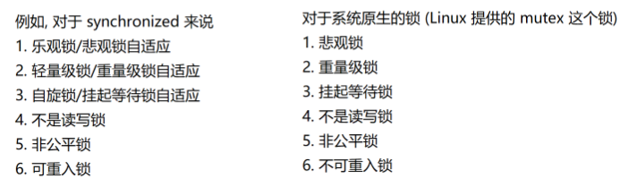

## synchronized 锁策略
#### 1.偏向锁阶段

核心思想：**懒汉模式**。**能不加锁，就不加锁。能晚加锁就晚加锁。**

偏向锁：**并非真的加锁，而是做一个轻量的标记（相当于搞暧昧）**。一旦有其他线程要和我竞争这个锁，我就在其他线程之前先把锁获取到。现在就会从偏向锁升级到轻量级锁了。

如果标记完没有线程来竞争，整个过程其实就把加锁省略了。
#### 2.轻量级锁阶段

通过自旋锁的方式来实现

优势：另外的线程把锁释放了，就会第一时间拿到锁；

劣势：CPU消耗大

在这个阶段，synchronized会进一步统计当前在这个锁对象上有多少个线程在参与竞争。如果发现参与竞争的线程比较多了，就会进一步升级到重量级锁

对于自旋锁来说，如果同一个锁的竞争者很多，大量的线程都在自旋，整体CPU的消耗就很大了
#### 3.重量级锁阶段

此时拿不到锁的线程就不再自旋了，而是进入阻塞等待，让出cpu

### 锁消除

synchronized内置的优化策略

编译器编译这个代码的时候，如果发现这段代码，不需要加锁就会**自动把锁干掉**

### 锁粗化

**锁的粒度（Lock Granularity）** 指的是：一把锁保护的数据范围有多大。

可以理解为：**这把锁“锁住多少东西”**。

锁粗话会把多个细粒度的锁合并成一个粗粒度的锁

细粒度：synchronized{ }，大括号里面包含的代码越少，锁的粒度越细；相反越粗

一般**锁的粒度越细，更有利于多个线程并发执行**；
但是由于每次加锁都会造成阻塞，所以粗化也能提高效率

### CAS

compare and swap：一个特殊的CPU指令，完成比较和交换的工作
只有当内存中的值等于“我认为的旧值”时，才把它改成新值，否则失败。

#### 核心思想

CAS 操作包含 **三个值**：`CAS(内存地址 V, 期望值 A, 新值 B)`

- 如果 `V == A`  
    就把 `V` 改成 `B`，并返回成功
- 否则  
    什么也不做，返回失败

这个操作是**原子性的**，由 CPU 直接支持。
#### 优点

之前保证线程安全都是靠加锁，加锁-->阻塞-->性能降低，而使用CAS，不涉及加锁，也不会阻塞，合理使用也能保证线程安全。--无锁编程
#### CAS的ABA问题

CAS在使用时，关键要点是要判定当前内存的值是否和寄存器中的值是一样的。本质上就是判定当前这个代码执行过程中是否有其他线程穿插进来。

可能存在这样的情况，数值原来是A，执行CAS之前，另一个线程把这个值从A改成B，又从B改成A。这个修改值又改回去的操作是在其他线程进行穿插时进行的，CAS无法感知到，这就是ABA问题，上面这种情况一般没啥问题。

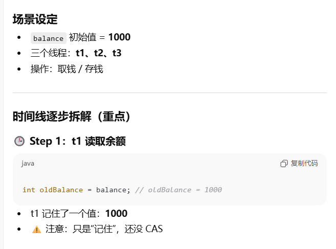
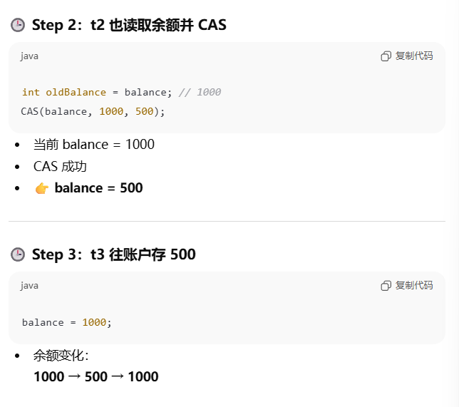


后果
- t2 已经取走 500
- t3 又存回 500
- t1 再取 500
**最终多取了一次钱**

##### ABA解决方案：

1.约定数据变化只是单向的（只增加或只减少），不能是双向的（又增加又减少）
2.对于本身就必须双向变化的数据，可以给它引入一个版本号（版本号是单向的）

### Callable接口：创建线程的第四种方式

前三种：1）继承Thread（包含匿名内部类），2）实现Runnable（包含匿名内部类），3）基于lambda表达式
第四种：使用Callable接口

区分Runnable和Callable

Runnable关注的是这个过程，不关注执行结果。因为其提供的run方法返回的是void
Callable关注执行结果。其提供的call方法返回线程执行任务得到的结果

### 可重入锁：ReentrantLock

1.ReentrantLock提供tryLock操作。

一般的lock是直接进行加锁，如果加锁不成就要阻塞
而**tryLock是尝试进行加锁**，如果加锁不成，**不阻塞**直接返回false。这样可以提供更多可操作空间

2.ReentrantLock提供公平锁的实现，通过**队列记录加锁线程的先后顺序**
而synchronized是非公平锁

3.搭配的等待通知机制不同

对于synchronized，搭配wait / notify
对于ReentrantLock，**搭配Condition类，功能比wait和notify强**

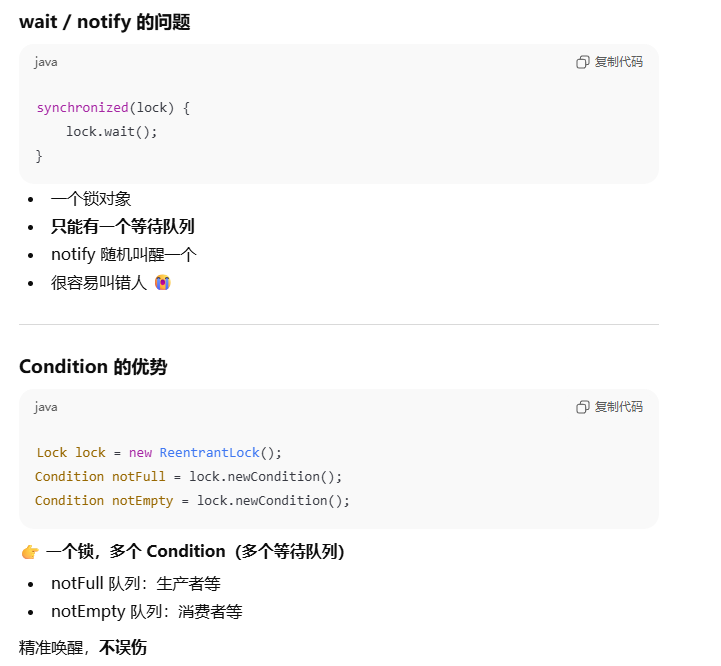

Condition 相比 wait/notify 的优势在于支持多个条件队列，实现更精细的线程等待与唤醒，避免无效唤醒，提高并发性能和代码可维护性。
### 信号量 Semaphore

比如我们去停车场，门口通常有一个电子牌，写着剩余xx个车位，这里的xx就是信号量

信号量表示可用资源的个数，**申请一个可用资源**，数字就会 **-1**，这个操作称为**P操作**

**释放一个可用资源**，数字就会 **+1**，这个操作称为**V操作**

锁也可以认为是计数值为1的信号量。释放状态就是1，加锁状态就是0。这种非0即1的信号量称为**二元信号量**

#### Semaphore的方法
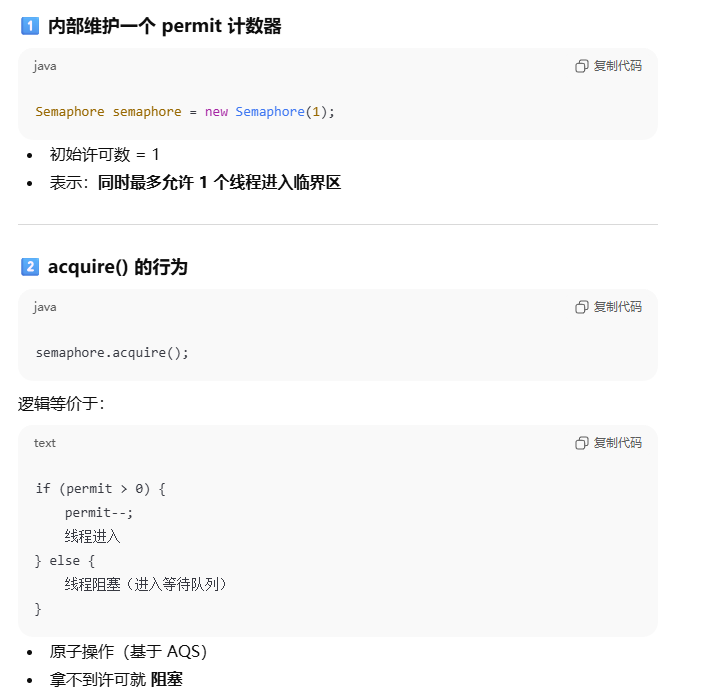
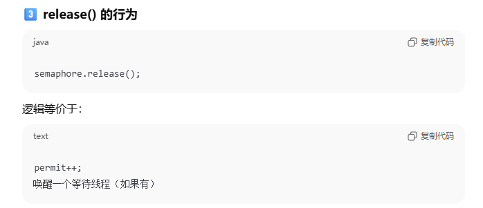
#### semaphore 实现生产者消费者模型

定义两个信号量，一个用来表示**队列中有多少个可以被消费的元素**，**sem1**
另一个用来表示**队列中有多少个可以放置新元素的空间**，**sem2**
生产一个元素，sem1.V(), sem2.P()
消费一个元素，sem1.P(), sem2.V()

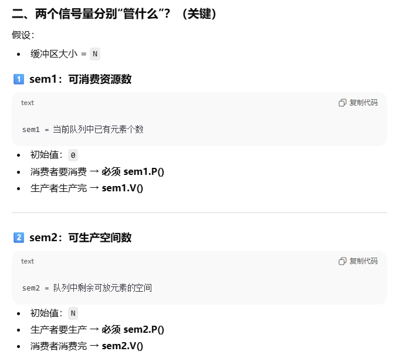
### CountDownLatch

比如多线程下载一个文件，这个文件可能很大，但是我们可以拆成多个部分，每个线程负责下载一个部分。下载完成之后，最终把下载的结果拼在一起

拼到一起的前提是所有线程都执行完毕，那怎么知道这些线程执行完毕了呢？

使用CountDownLatch可以很方便感知到这件事，无需多次调用join（借助join的方式，只能使每个线程执行一个任务，而countDownLatch可以让一个线程执行多个任务


# 文件IO

## 文件是啥？

对于计算机来说，文件是一个广义的概念

1.硬盘上的普通文件

2.硬盘上的目录

3.很多硬件设备被操作系统抽象成了文件。比如键盘，显示器，网卡等

### 路径

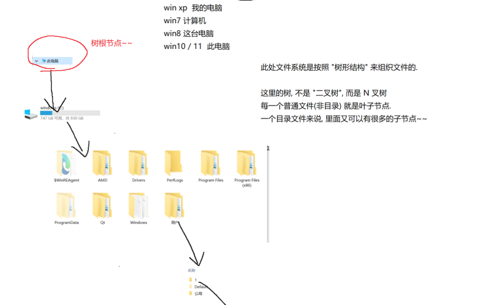

1.**绝对路径**。从树的根节点出发（Windows是盘符），一层一层到达目标文件

2.**相对路径**。先指定一个**“当前目录”**/“工作目录”/“基准目录”，从当前目录出发，找到目标文件

## Java对于文件操作的API

### 1.针对文件系统的操作（右键文件目录能进行的操作）

#### File类里面的方法


### 2.针对文件内容的操作，读文件/写文件

流：操作系统提供的概念

像接水一样，有100ml，可以一次接10ml，接10次；一次接5ml，接20次。怎么接结果都一样

文件流也一样，比如要读写100字节的数据，可以一次读写10字节，分10次；也可以一次读写5字节，分20次；此处的读写方式是任意多的情况，最终的效果是一样的
#### 1.字节流

打开/关闭文件
以字节为单位进行读写，一次最少读写一个字节

顶层类：**InputStream和OutputStream**
InputStream是一个抽象类，无法被实例化，所以不能直接new

但是我们可以使用InputStream其中一个子类进行实例化
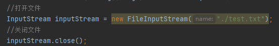

这里的关闭文件可以理解为释放了文件的相关资源

#### 为什么要关闭文件？（文件资源泄露问题）

文件描述符表记录了当前进程都打开了哪些文件，这个表类似顺序表或者数组，数组中的每个元素都是一个结构体，这个结构体具体描述了了这个文件的一些属性。

因为每次打开一个文件都会在文件描述符表占据一个位置，如果长期不关闭文件就会使文件描述符表空间被耗尽（⚠文件描述符表无法自动扩容，因为操作系统内核任务重，对性能要求高，如果引起卡顿后果无法设想）

如果空间被耗尽，后面的文件就无法打开

#### 2.字符流

**字符流是以“字符（char）”为单位进行读写的 IO 流，主要用于处理文本数据。**

- 一个字符 = **2 个字节（Java 中）**
- 自动处理 **字符编码 / 解码**
- 面向“人类可读文本”

字符流的顶层抽象类是：

```
Reader   —— 字符输入流（读） 
Writer   —— 字符输出流（写）
```

结构图

```
Reader
 ├─ FileReader
 ├─ BufferedReader
 ├─ InputStreamReader 
 └─ StringReader

Writer
 ├─ FileWriter
 ├─ BufferedWriter
 ├─ OutputStreamWriter 
 └─ StringWriter

```

|对比点|字符流|字节流|
|---|---|---|
|单位|char|byte|
|是否处理编码|✅ 自动|❌ 不处理|
|适合场景|文本|二进制|
|顶层类|Reader / Writer|InputStream / OutputStream|
|是否通用|否|是|
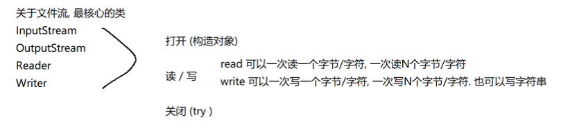
## 网络
### IP地址

描述一个设备在网络上的位置

本质上是32位，4个字节的整数，为了方便表示，把IP地址表示成“点分十进制”的形式。使用3个“.”把4个字节分成4个部分，每个部分1个字节。取值范围是0~255

比如 192.168.2.101
### 端口号

描述一个主机/设备上的哪个程序正在使用网络（IP确定主机）

端口号可以是用户手动指定的，也可能是系统自动分配的

同一个主机上，程序之间使用的端口号不能冲突（端口号是一个整数）

进行一次网络通信的过程中，涉及到的IP和端口其实各有两个。与我们网购买东西一样

收件人地址  ---->  目的IP

收件人电话  ---->  目的端口

发件人地址  ---->  源IP

发件人电话  ---->  源端口
### 协议

通信过程中的一种约定。发送方和接收方需要提前商量好数据的格式，才能确保二者之间能正确进行沟通

通信的两个计算机可能来自不同的两个厂商，协议就能够使两个厂商产出的设备相互配合

#### 五元组

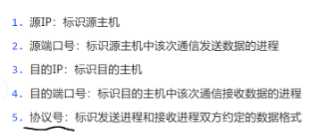

#### 为啥有协议号？

网络通信过程中的细节很多，如果只靠一个协议把这些庞杂的细节记录下来，非常不利于学习和维护。所以就要把一个高大全的协议拆分成多个小而美的协议

协议太多怎么办？协议号可以给每个协议做标识

引入协议分层。--》相当于公司
功能相似的协议放到同一层之中，上层协议可以调用下层协议的功能，下层协议为上层协议提供服务。--》相当于一个公司的组织架构，上级领导管理下层员工，下层员工给上级领导打工

只有相邻层级的协议可以进行沟通，不能跨层调用（会引起混乱）--》相当于越级汇报

**附带好处**

1.下层协议把细节都封装好了，上层协议可以直接使用下层协议，不需要了解下层协议的细节

2.某一层的协议进行替换之后，对于其他层没啥影响
 
**应用层**：程序拿到数据包之后要用来干啥，解决什么问题（快递到手后随买主自由操作）
**传输层**：负责关注网络数据包的起点和终点，端到端之间的传输（快递从哪送到哪）
**网络层**：负责关注从起点到终点要走哪条路（路径规划）（快递怎么送过来）
**数据链路层**：负责两个相邻结点的传输（快递包中转点）
**物理层**：通信中的基础设施（快递传输中的公路，铁路等）
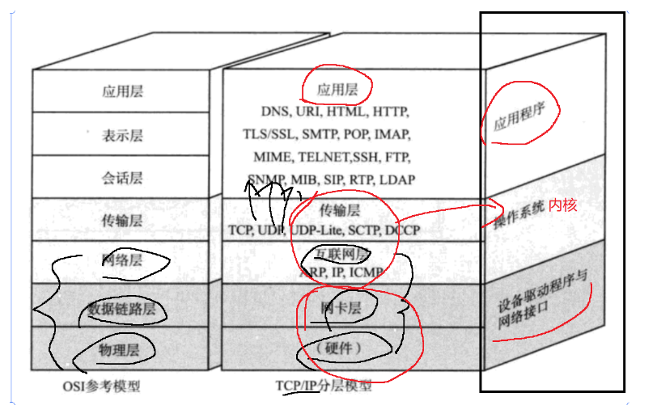
### 运行逻辑：封装+分用

#### 封装

1.应用层（应用程序） 

QQ在输入框获取hello，把这个数据按照QQ预先设置的应用层协议构成一个应用层的数据包
这里的应用层协议是一个字符串拼接的格式，应用程序就会调用操作系统提供的API，把这个数据包交给传输层
![[img-20260107-7.png]]

2.传输层
传输层把从应用层获取的数据作为一个整体重新构成一个传输层的数据包。
传输层的协议主要是TCP和UDP。假设用UDP，就会造一个UDP数据包
![[img-20260107-8.png]]


添加报头的过程就叫封装（其实是字符串拼接，拼完的报头有一定的结构）

报头的作用并不是保护数据，可以起到贴标签类似的效果，可以承载源端口和目的端口这类用来转发的信息

3.网络层
核心协议：IP协议

把刚才的传输层UDP数据包作为一个整体，再拼上一个IP协议的报头，构成一个IP数据包
![[img-20260107-9.png]]
IP报头最重要的信息就是源IP和目的IP

4.数据链路层
涉及的核心协议：以太网（"以太"用来表示网络传输的介质）

以太网就是我们日常见到的有线网络，网口：以太网口；网线：以太网线；交换机：以太交换机

以IP数据包为一个整体，添加上帧头和帧尾，构成一个以太网数据帧
![[img-20260107-10.png]]


5.物理层 （硬件设备）
把上述的以太网数据帧（是二进制结构），转换成光信号（光纤）/电信号（网线）/电磁波（无线WiFi），然后进行发送

#### 分用

假定数据包已经到达B的网卡了，B将A封装的东西层层解析过程就叫分用

1.B的物理层
B的物理层收到了光信号/电信号/电磁波。就会把这些物理信号转换成数字信号，得到一个以太网数据帧，进一步地把这个数据帧交给数据链路层处理

2.数据链路层 -- 以太网
![[img-20260107-11.png]]

3.网络层 -- IP协议

![[img-20260107-12.png]]
4.传输层 -- UDP协议
![[img-20260107-13.png]]

5.应用层
![[img-20260107-14.png]]

QQ在B窗口弹出提示，把消息/消息发送者/发送时间显示在聊天窗口上

分用的过程就是封装的逆过程

真实情况下，两台主机一般不会通过网线直连，而是通过一系列交换机或者路由器来进行数据转发
即使经过交换机或路由器，封装分用的过程也是适用的
经典的交换机只封装分用到数据链路层；经典的路由器只封装分用到网络层
  


## 客户端和服务器

客户端：在网络中**主动**发起通信的一方
服务器：被动**接受**的一方

客户端给服务器发送的数据，称为**请求（request）**
服务器返回给客户端的数据，称为**响应（response）**

1.一问一答：一个请求对应一个响应，进行**web开发**就是这种模式
2.一问多答：一个请求对应多个响应，涉及到**下载**的场景
3.多问一答：多个请求对应一个响应，涉及到**上传**的场景
4.多问多答：多个请求对应多个响应，涉及到**远程控制**的场景
### TCP VS UDP

进行网络编程需要使用系统的API，本质上是由传输层提供的

涉及到TCP和UDP两个协议，两个协议差异很大

TCP特点：有连接；可靠传输；面向字节流；全双工
UDP特点：无连接；不可靠传输；面向数据报；全双工
#### 连接

有连接：**指抽象且虚拟的连接**。连接的特点是双方都能认同，例如打电话就是有连接的通信方式
无连接：例如发微信/短信，无论你是否同意，我都能给你发过去

网络中的连接：通信双方有一些数据结构能各自保存对方的相关信息
#### 传输可靠性

前提：无论使用什么技术，都无法100%保证网络数据能从A传到B

可靠传输：尽可能完成数据传输，无法确保对方是否收到，但发送方可以知道对方是否收到了
不可靠传输：就是不知道对方是否收到数据咯
#### 面向字节流/数据报

面向字节流：和文件的字节流一致，网络中传输的数据基本单位是字节
面向数据报：传输(发送和接收数据)的基本单位是一个数据报（由一系列字节构成的特定的结构）
#### 全双工

全双工：一个信道可以双向通信（类似日常见到的马路）
半双工：只能单向通信

UDP socket api的使用
核心的类有两个：DatagramSocket, DatagramPacket

操作系统中有一种文件叫socket文件，这种文件抽象表示了网卡这个硬件设备

网卡：进行网络通信最核心的硬件设备

通过网卡发送数据，就是写socket文件

通过网卡接收数据，就是读socket文件 
