# 时间复杂度 和 集合框架
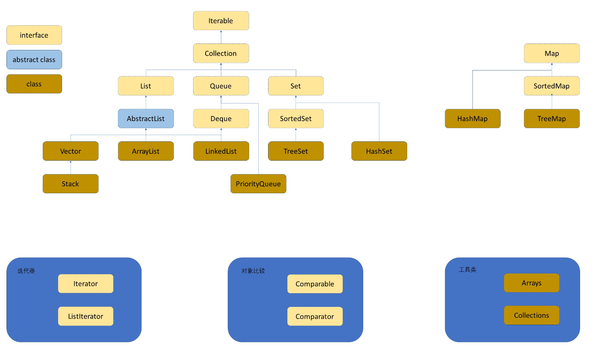


**二分查找**
```java
while (begin <= end) {
    mid = begin + (end - begin) / 2;

    if (array[mid] < value)
        begin = mid + 1;
    else if (array[mid] > value)
        end = mid - 1;
    else
        return mid;
}
return -1;
```
假设查找次数为 y，则：

`n / 2^y = 1 → n = 2^y → y = log₂n`

所以时间复杂度为：`O(log n)`

**斐波那契数列**
```
           F(n)
      /           \
   F(n-1)        F(n-2)
   /    \          /    \
F(n-2) F(n-3)   F(n-3) F(n-4)
...
```
1. 形成一棵高度为 N 的二叉树。二叉树节点数：`≈ 2^N`
2. 递归次数类似：`2^0 + 2^1 + 2^2 + ... + 2^(n-1)`
3. 几何级数求和：`Sn = 2^n - 1`
4. 所以时间复杂度：`O(2^N)`

**空间复杂度**关键点不是看有多少次递归，而是看**递归深度**
对于斐波那契数列而言，最深的路径就是 `fib(n) → fib(n-1) → fib(n-2) → … → fib(1)`
长度为 **n**。

# 包装类

装箱（auto-boxing）：基本类型 → 包装类型
`Integer a = 10;   // 自动转为 Integer.valueOf(10)`

拆箱（auto-unboxing）：包装类型 → 基本类型
`int b = a;  // 自动转为 a.intValue()`

装箱和拆箱都是**编译器帮我们做的**，所以是**自动**的
## 泛型

1. 泛型就是把类型当成参数传递给类、接口、方法，让容器记住它应该存的类型，从**编译**阶段就**发现类型错误**，避免运行时报错。
2. 泛型是在编译阶段存在的，到JVM运行阶段这个概念就不成立了
3. 
```
ArrayList<int> ❌ 不允许
ArrayList<Integer> ✔ 正确
```
### **擦除机制**：

编译器在编译时会把泛型信息擦除 → 变成原始类型（一般为 Object 或边界类型）
例如：
```java
class Box<T> {
    T data;
}
```
编译后的字节码中实际变成：
```java
class Box {
    Object data;
}
```
泛型只是**编译期检查规则**，运行时不会保留类型参数。

### 泛型的上界：

可以给泛型加约束，让其必须是某个类的子类或实现某个接口

例如：
`<T extends Number>`
表示 T 必须是 Number 或其子类（Integer、Double 等）。

### 通配符（Wildcard）?

让方法或类可以接收“多种类型的泛型参数”，从而提高泛型的灵活性，同时又保证类型安全
**泛型 = 限制类型**  
**通配符 = 放宽这种限制（但仍保持安全）**

（1）? extends T —— 上界通配符（可以读，不能写）
	`? extends Fruit`
表示：该泛型容器里存的是 Fruit 或其子类（Apple、Banana）。
用途：
- 常用于 **读取**（get）
- 不允许 add（除了 null）
- 因为你不知道到底是 Fruit 还是 Apple 还是 Banana
	`? extends T —— 读可以，写不行`

（2）? super T —— 下界通配符（可以写，读只能是 Object）
	`? super Fruit`
表示：这是 Fruit 的父类类型（如 Food、Object）的泛型容器
用途：
- 常用于 **写入**（add Fruit 或其子类）
- 读取只能得到 Object，因为你不确定具体类型
	`? super T —— 写可以，读不行`

`? extends T` —— 生产者（Producer）安全，适合读
`? super T` —— 消费者（Consumer）安全，适合写

# ArrayList

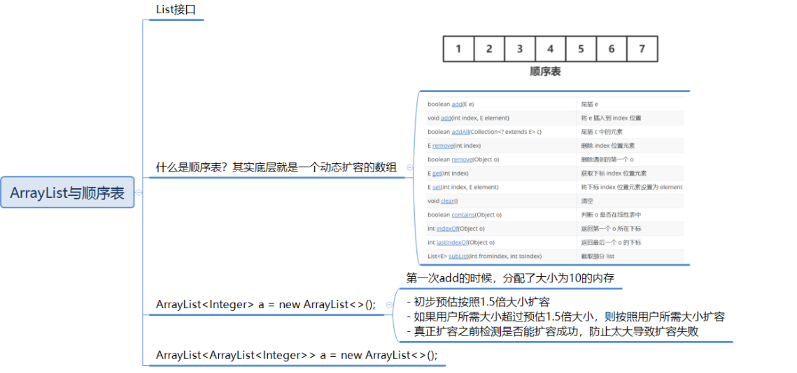

- List 是 **Collection 的子接口**
- 特点：**有序、可重复、线性表结构**
- 常见实现类：**ArrayList、LinkedList**

顺序表 = 物理地址连续的存储空间 + 按顺序存储数据
## ArrayList

ArrayList 是：

- 一个 **实现了 List 接口的类**
- 底层使用 **动态数组**（可自动扩容）
- 支持 **随机访问（实现了 RandomAccess 接口）**
- 实现了 **Cloneable、Serializable**
- **非线程安全**（多线程情况下使用 Vector / CopyOnWriteArrayList）

扩容步骤：

1. 判断是否需要扩容（minCapacity > 当前容量）
2. 预计扩大为原来的 **1.5 倍**
    `newCapacity = oldCapacity + oldCapacity >> 1`
3. 如果用户需求比 1.5 倍还大 → 使用用户需求容量
4. 检查是否超过最大数组限制（MAX_ARRAY_SIZE）
5. 使用 `Arrays.copyOf()` 执行扩容

扩容过程 =  **申请新空间 → 拷贝旧数据 → 释放旧空间**
### 方法

|方法|解释|
|---|---|
|`boolean add(E e)`|尾插 e|
|`void add(int index, E element)`|将 e 插入到 index 位置|
|`boolean addAll(Collection<? extends E> c)`|尾插 c 中的元素|
|`E remove(int index)`|删除 index 位置元素|
|`boolean remove(Object o)`|删除遇到的第一个 o|
|`E get(int index)`|获取下标 index 位置元素|
|`E set(int index, E element)`|将下标 index 位置元素设置为 element|
|`void clear()`|清空|
|`boolean contains(Object o)`|判断 o 是否在线性表中|
|`int indexOf(Object o)`|返回第一个 o 所在下标|
|`int lastIndexOf(Object o)`|返回最后一个 o 所在下标|
|`List<E> subList(int fromIndex, int toIndex)`|截取部分 list（左闭右开）|

```java
List<String> a = new ArrayList<>();
List<Double> b = new ArrayList<>();
List<List<Integer>> c = new ArrayList<>();
```
<> 代表：请编译器使用我左边的类型参数。

# 链表

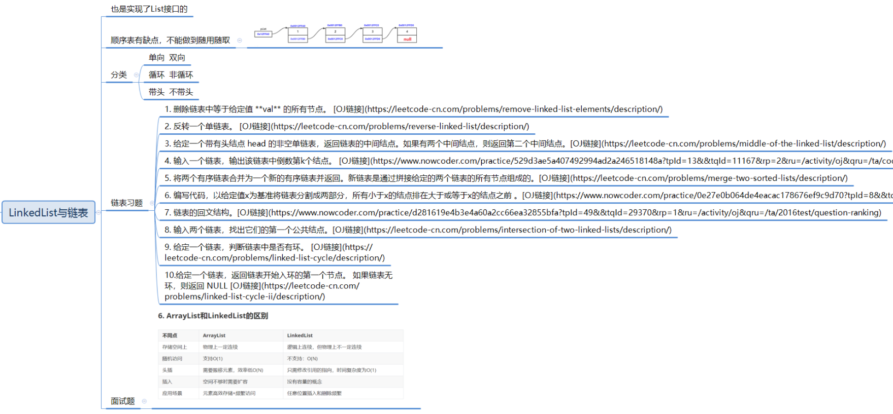

## 为什么需要 LinkedList？

ArrayList 底层是 **连续数组**，存在缺陷：

- 在任意位置插入、删除元素需要整体搬移 → **O(n)**，效率低
- 适合读操作（随机访问快），不适合频繁增删
因此引入 **LinkedList（链表结构）** 来解决这一问题。

## 链表介绍

链表是一种 **物理空间不连续，但逻辑顺序连续** 的数据结构。

节点结构如下：

`data + next (单链表) data + next + prev (双链表)`

1. 无头单向非循环链表（单链表）

- 结构简单
- 常用于面试、OJ题
- 也常用作其他数据结构的基础（如哈希桶、邻接表）

2. 无头双向链表（LinkedList 的底层）

- 双向指针 prev / next
- 插入删除更高效
- Java LinkedList 采用 **双向循环链表**

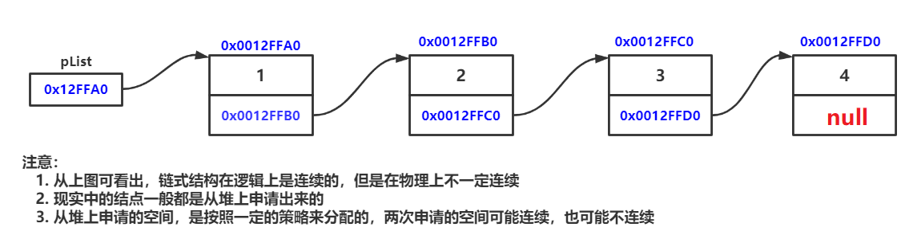


| 项目        | ArrayList  | LinkedList |
| --------- | ---------- | ---------- |
| 底层结构      | 动态数组（连续空间） | 双向链表（不连续）  |
| 随机访问      | O(1) 非常快   | O(n) 很慢    |
| 插入/删除（中间） | O(n) 需要搬移  | O(1) 修改指针  |
| 扩容        | 需要，代价高     | 无需扩容       |
| 内存占用      | 紧凑         | 节点额外开销大    |
| 适用场景      | 读多写少       | 写多读少、频繁插删  |
## 方法

1. 增加元素（Add）

|方法|功能说明|
|---|---|
|`add(e)`|在链表尾部插入元素|
|`addFirst(e)`|在链表头部插入元素|
|`addLast(e)`|在链表尾部插入（与 add 等价）|
2. 删除元素（Remove）

|方法|功能说明|
|---|---|
|`remove()`|删除第一个元素（空时抛异常）|
|`removeFirst()`|删除头部元素（空时抛异常）|
|`removeLast()`|删除尾部元素（空时抛异常）|
|`poll()`|删除并返回头部元素（空返回 null）|
|`pollFirst()`|删除并返回头部元素（空返回 null）|
|`pollLast()`|删除并返回尾部元素（空返回 null）|
3. 获取元素（Get / Peek）

|方法|功能说明|
|---|---|
|`get(index)`|获取指定下标元素（O(n)）|
|`getFirst()`|获取头部元素（空时抛异常）|
|`getLast()`|获取尾部元素（空时抛异常）|
|`peek()`|查看头部元素（空返回 null）|
|`peekFirst()`|查看头部元素（空返回 null）|
|`peekLast()`|查看尾部元素（空返回 null）|
4. 遍历（Iterator）

|方法|功能说明|
|---|---|
|`iterator()`|返回正向迭代器|
|`listIterator()`|返回可以双向遍历的迭代器|
### 链表一些刷题的方法
#### 头插法

1. 实例化一个节点
2. 改变插入结点的next
3. 改变head
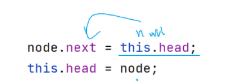
4. 时间复杂度 O(1)
### 尾插法

将待插入的节点存放到链表的最后一个位置
1. 实例化一个节点
2. 找到最后一个节点cur
3. 让cur停在最后一个节点的位置 cur.next != null; 如果想把整个链表都遍历完，就是cur != null
4. cur.next=node
5. 时间复杂度O(N)
#### 在任意位置插入节点

1. 让cur走index-1步
2. node.next = cur.next; cur.next = node;
#### 删除元素

现在我们想删除第三个节点，把第三个节点设成del
1. 在一个循环里面让cur遍历整个链表
2. 判断 cur.next.val == key，找到cur的位置
3. 后面ListNode del = cur.next; cur.next = del.next
#### 删除所有值为key的节点 

比如下面删除所有值为23的节点
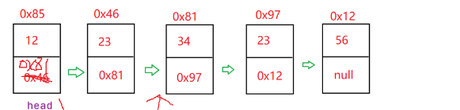
定义cur为当前要删除的节点; prev为当前要删除的节点的前驱
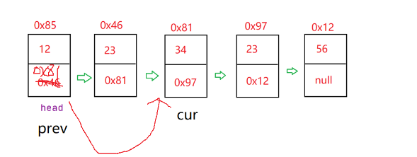
cur找到了就直接把prev的next地址改成cur下一个节点的地址，cur继续往下遍历

```java
while(cur!=null){
        if(cur.val == key){
                prev.next = cur.next; //删除操作
                cur = cur.next;
        }else{
                prev = cur;
                cur = cur.next
        }
}
```
#### 清空链表

把所有节点的val = null, next = null，再把链表的head = null
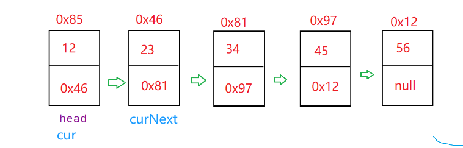
注意：这里的val = null不是直接让你 cur.val = null，拿第一个节点来说，如果你把值置为空，那么0x46被替换成null，cur找不到下一个节点的地址0x46了

我们可以拿一个变量curNext来记录cur下一个节点的位置，把cur.next 置为空之后，cur往后挪到curNext的位置，继续置空下一个节点

注意别忘了头节点，整个遍历完之后还要把头节点也置为空

# 栈和队列

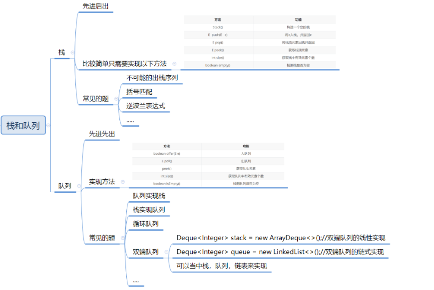
## 栈

**栈**：一种特殊的线性表，其只允许在固定的一端进行插入和删除元素操作。进行数据插入和删除操作的一端称为栈顶，另一端称为栈底。栈中的数据元素遵守后进先出LIFO（Last In First Out）的原则。

**压栈**：栈的插入操作叫做进栈/压栈/入栈，入数据在栈顶。

**出栈**：栈的删除操作叫做出栈。出数据在栈顶。

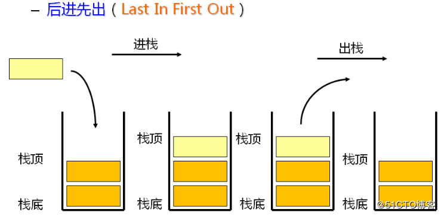

| 方法                | 功能           |
| ----------------- | ------------ |
| `Stack()`         | 构造一个空的栈      |
| `E push(E e)`     | 将 e 入栈，并返回 e |
| `E pop()`         | 将栈顶元素出栈并返回   |
| `E peek()`        | 获取栈顶元素（不出栈）  |
| `int size()`      | 获取栈中有效元素个数   |
| `boolean empty()` | 检测栈是否为空      |
Stack继承了**Vector**，Vector和ArrayList类似，都是动态的顺序表，不同的是Vector是线程安全的。

| 名称                  | 概念                         | 归属       |
| ------------------- | -------------------------- | -------- |
| **栈**               | 一种数据结构（LIFO）               | 算法结构     |
| **虚拟机栈**            | JVM 运行时区域之一，维护线程的方法调用      | JVM 内存模型 |
| **栈帧（Stack Frame）** | 每次方法调用产生一个栈帧，包含局部变量表、操作数栈等 | JVM 栈的元素 |
```
线程 Thread
 └── 虚拟机栈 JVM Stack
       ├── 栈帧 Frame（方法A）
       ├── 栈帧 Frame（方法B）
       └── 栈帧 Frame（方法C）
```
### 常见面试题

1. 判断一个序列是否可能是栈的出栈序列 [栈的压入、弹出序列_牛客题霸_牛客网 (nowcoder.com)](https://www.nowcoder.com/practice/d77d11405cc7470d82554cb392585106?tpId=13&&tqId=11174&rp=1&ru=/activity/oj&qru=/ta/coding-interviews/question-ranking "栈的压入、弹出序列_牛客题霸_牛客网 (nowcoder.com)")
2. 最小栈设计 [155. 最小栈 - 力扣（LeetCode）](https://leetcode.cn/problems/min-stack/description/ "155. 最小栈 - 力扣（LeetCode）")
3. 括号匹配 [20. 有效的括号 - 力扣（LeetCode）](https://leetcode.cn/problems/valid-parentheses/description/ "20. 有效的括号 - 力扣（LeetCode）")
4. 逆波兰表达式求值 [150. 逆波兰表达式求值 - 力扣（LeetCode）](https://leetcode.cn/problems/evaluate-reverse-polish-notation/description/ "150. 逆波兰表达式求值 - 力扣（LeetCode）")
	1. 逆波兰表达式是一种后缀表达式。我们平常写的算式是中缀表达式 比如：9+(3-1)\*3+8/2改成后缀表达式就是 9 3 1 - 3 * + 8 2 / +
## 队列

**队列**：只允许在一端进行插入数据操作，在另一端进行删除数据操作的特殊线性表，队列具有先进先出FIFO(First In First Out) 
**入队列**：进行插入操作的一端称为队尾（Tail/Rear） 
**出队列**：进行删除操作的一端称为队头

在Java中，**Queue**是个接口，底层是通过链表实现的。

| 方法          | 说明        |
| ----------- | --------- |
| `offer(e)`  | 入队        |
| `poll()`    | 出队并返回队头元素 |
| `peek()`    | 查看队头元素    |
| `size()`    | 元素个数      |
| `isEmpty()` | 是否为空      |
### 常见面试题

1. **用两个队列实现栈**
2. **用两个栈实现队列**
3. [622. 设计循环队列 - 力扣（LeetCode）](https://leetcode.cn/problems/design-circular-queue/ "622. 设计循环队列 - 力扣（LeetCode）")
4. [225. 用队列实现栈 - 力扣（LeetCode）](https://leetcode.cn/problems/implement-stack-using-queues/description/ "225. 用队列实现栈 - 力扣（LeetCode）")
5. [232. 用栈实现队列 - 力扣（LeetCode）](https://leetcode.cn/problems/implement-queue-using-stacks/description/ "232. 用栈实现队列 - 力扣（LeetCode）")

# 二叉树

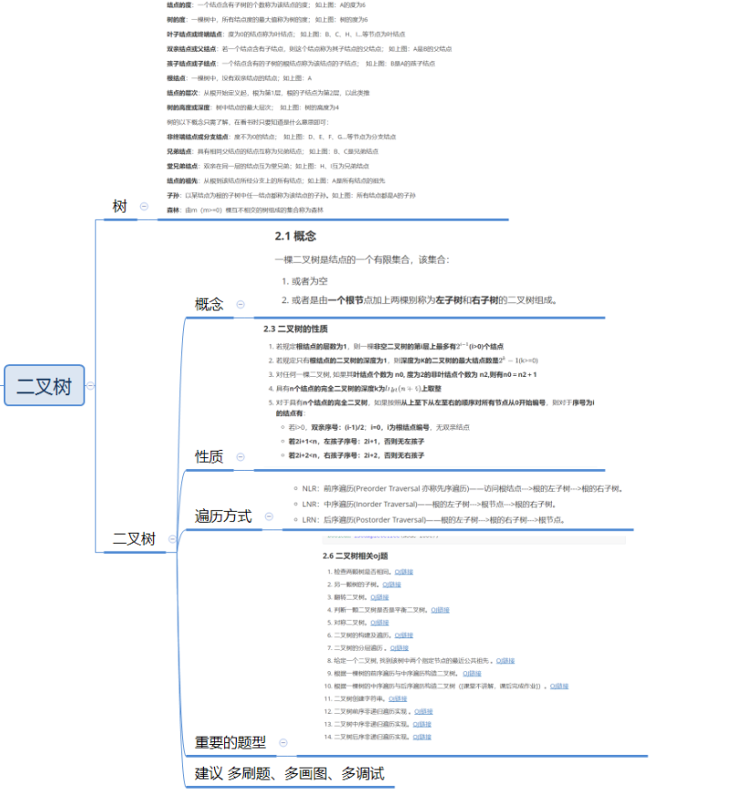


## 二叉树定义
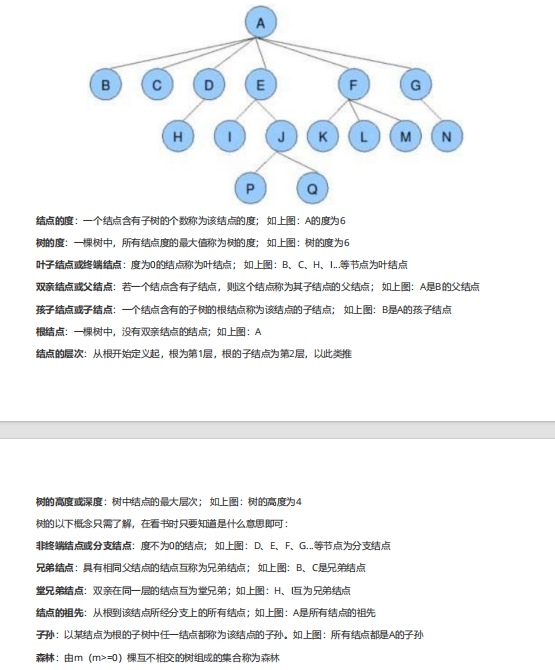

二叉树是一个有限节点集合

- 可以为空
- 或由 **一个根节点 + 左子树 + 右子树** 组成
- **左右子树有顺序，不能颠倒**

二叉树的存储分为**顺序存储（堆）** 和**链式存储**
### 满二叉树 & 完全二叉树

| 类型        | 特点                   | 关键点           |
| --------- | -------------------- | ------------- |
| **满二叉树**  | 每一层节点数都达到最大          | 节点数 = 2^k - 1 |
| **完全二叉树** | 最后一层可以不满，但**从左到右连续** | 堆、数组存储        |
### 二叉树 5 大性质

1. 第 i 层最多节点数
```
2^(i-1)
```

2. 深度为 k 的二叉树最大节点数
```
2^k - 1
```

3. 叶子结点数公式
```
n0 = n2 + 1
```
> n0：叶子节点数  
> n2：度为 2 的节点数

4. 完全二叉树高度
```
h = ⌈log2(n+1)⌉
```

5. 完全二叉树数组下标关系
	若节点编号从 0 开始：
	- 父节点：(i - 1) / 2
	- 左孩子：2i + 1
	- 右孩子：2i + 2
## 遍历方式

遍历(Traversal)是指沿着某条搜索路线，依次对树中每个结点均做一次且仅做一次访问
### 四种遍历

#### ① 前序遍历（NLR）
```
根 → 左 → 右
```
[144. 二叉树的前序遍历 - 力扣（LeetCode）](https://leetcode.cn/problems/binary-tree-preorder-traversal/description/ "144. 二叉树的前序遍历 - 力扣（LeetCode）")
#### ② 中序遍历（LNR）
```
左 → 根 → 右
```
#### ③ 后序遍历（LRN）
```
左 → 右 → 根
```

#### ④ 层序遍历（Level Order）

```
从上到下，从左到右（用队列）
```
### 基本操作

[100. 相同的树 - 力扣（LeetCode）](https://leetcode.cn/problems/same-tree/description/ "100. 相同的树 - 力扣（LeetCode）")
[572. 另一棵树的子树 - 力扣（LeetCode）](https://leetcode.cn/problems/subtree-of-another-tree/description/ "572. 另一棵树的子树 - 力扣（LeetCode）")
[226. 翻转二叉树 - 力扣（LeetCode）](https://leetcode.cn/problems/invert-binary-tree/ "226. 翻转二叉树 - 力扣（LeetCode）")
[110. 平衡二叉树 - 力扣（LeetCode）](https://leetcode.cn/problems/balanced-binary-tree/description/ "110. 平衡二叉树 - 力扣（LeetCode）")
[101. 对称二叉树 - 力扣（LeetCode）](https://leetcode.cn/problems/symmetric-tree/ "101. 对称二叉树 - 力扣（LeetCode）")
[二叉树遍历_牛客题霸_牛客网 (nowcoder.com)](https://www.nowcoder.com/practice/4b91205483694f449f94c179883c1fef?tpId=60&&tqId=29483&rp=1&ru=/activity/oj&qru=/ta/tsing-kaoyan/question-ranking "二叉树遍历_牛客题霸_牛客网 (nowcoder.com)")
[102. 二叉树的层序遍历 - 力扣（LeetCode）](https://leetcode.cn/problems/binary-tree-level-order-traversal/description/ "102. 二叉树的层序遍历 - 力扣（LeetCode）")
[236. 二叉树的最近公共祖先 - 力扣（LeetCode）](https://leetcode.cn/problems/lowest-common-ancestor-of-a-binary-tree/description/ "236. 二叉树的最近公共祖先 - 力扣（LeetCode）")
[105. 从前序与中序遍历序列构造二叉树 - 力扣（LeetCode）](https://leetcode.cn/problems/construct-binary-tree-from-preorder-and-inorder-traversal/description/ "105. 从前序与中序遍历序列构造二叉树 - 力扣（LeetCode）")
[106. 从中序与后序遍历序列构造二叉树 - 力扣（LeetCode）](https://leetcode.cn/problems/construct-binary-tree-from-inorder-and-postorder-traversal/description/ "106. 从中序与后序遍历序列构造二叉树 - 力扣（LeetCode）")
[606. 根据二叉树创建字符串 - 力扣（LeetCode）](https://leetcode.cn/problems/construct-string-from-binary-tree/description/ "606. 根据二叉树创建字符串 - 力扣（LeetCode）")
[144. 二叉树的前序遍历 - 力扣（LeetCode）](https://leetcode.cn/problems/binary-tree-preorder-traversal/description/ "144. 二叉树的前序遍历 - 力扣（LeetCode）")

# 优先级队列

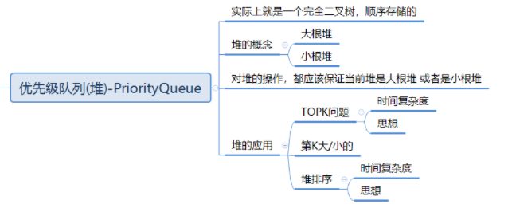
数据结构应该提供两个最基本的操作，一个是返回最高优先级对象，一个是添加新的对象。这种数据结构就是优先级队列(Priority Queue)

PriorityQueue底层使用了**堆**这种数据结构，而堆实际就是在完全二叉树的基础上进行了一些调整。

**堆**的性质：
- 堆中某个节点的值总是不大于或不小于其父节点的值；
- 堆总是一棵完全二叉树。
注意：对于非完全二叉树，则不适合使用顺序方式进行存储，因为为了**能够还原二叉树，空间中必须要存储空节点，就会导致空间利用率比较低。**

**大根堆：** 每一棵树的根结点总是比左右子节点大
**小根堆：** 每一棵树的根结点的值总是比左右子节点小，不考虑左右子节点谁大谁小
**堆的存储**：存储方式采用层序遍历的方式把二叉树的元素一一放到数组里面

### 堆的操作

1. 如何将普通数组转换成堆（怎么计算这个堆的时间复杂度?）
2. 堆的插入
3. 堆的删除
4. [面试题 17.14. 最小K个数 - 力扣（LeetCode）](https://leetcode.cn/problems/smallest-k-lcci/description/ "面试题 17.14. 最小K个数 - 力扣（LeetCode）")
5. 堆排序
# 排序

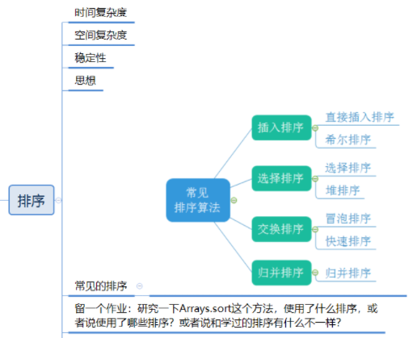
### 直接插入排序

直接插入排序
动图演示如下：


我们可以设置两个指针i和j，i放在第二个元素的位置，j放在第一个元素的位置
每次把i位置的元素提取出来放到tmp中，和j位置的元素进行比较，如果tmp的元素较小，就与j位置元素进行交换
交换完之后j--，看看前面还有没有元素比交换后靠前的元素大，如果有就重复上述步骤，没有就把j和i挪到下一个元素
### 希尔排序

初始数据我们可以分成5组，此时的增量就是5，接着第1个元素与第6个元素，第2个元素与第7个元素等两两交换
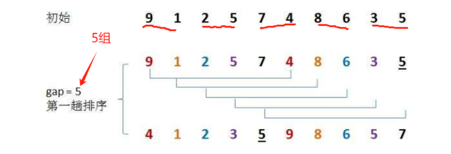


接着降低增量（gap / 2），增加每组的数据，继续进行排序

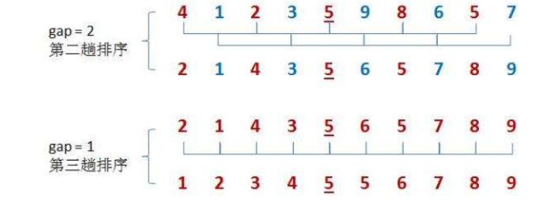

其实前面的增量分组相当于一个预排序，真正的排序是最后一组

### 直接选择排序

**动图如下：**  


设置i和j，遍历当前i下标后面的元素（j++），找到一个最小的值与i下标的元素进行替换
然后i++，进行下一个元素的交换

### 冒泡排序

**动图如下：**  


## 堆排序
### 阶段 1：建堆（Build Heap）

- 把无序数组调整成一个 **大根堆**（或小根堆）
- 大根堆特点：
    - 根节点是当前最大值
- 建堆完成后：
    - `array[0]` 一定是最大元素

### 阶段 2：排序（Sort）

- 重复以下步骤：
    1. 把 **堆顶元素（最大值）** 与 **当前末尾元素** 交换
    2. 堆的有效长度减 1（最大值已归位）
    3. 对新的堆顶执行 **向下调整（siftDown）**
- 直到堆中只剩 1 个元素
### 快速排序

排序的整体流程

1. 对当前区间 `[start, end]` 进行排序
2. 如果区间中元素个数 ≤ 1，直接结束（递归终止条件）
3. 否则：
    - 选取一个元素作为 **基准值 pivot**
    - 通过一次 **分区操作（partition）**：
        - 将 pivot 放到它最终应该在的位置
        - 同时保证：
            - pivot 左边的元素 ≤ pivot
            - pivot 右边的元素 ≥ pivot
    - 对 pivot 左右两侧的子区间分别递归执行快速排序
#### （partition）过程Hoare法

1. 选择区间的 **第一个元素** 作为 pivot
2. 使用两个指针：
    - `left` 从左向右扫描
    - `right` 从右向左扫描
3. 指针移动规则：
    - `right` 向左移动，寻找 **第一个小于 pivot 的元素**
    - `left` 向右移动，寻找 **第一个大于 pivot 的元素**
4. 当 `left < right` 时：
    - 交换这两个“放错位置”的元素
5. 重复上述过程，直到 `left` 和 `right` 相遇
6. 将 pivot 与相遇位置的元素交换
7. 此时 pivot 位于最终正确位置，返回该位置

单趟动图如下：  


第一轮交换之后，6在中间，6的左边都比6小，右边都比6大


第二轮和第一轮一样，接着不停地递归下去


这些数组可以拆分并组成一棵二叉树如下图，二叉树就是左边和右边分别递归 


## 归并排序
![[img-20251216.png]]

- **分解**
    - 把当前数组从中间一分为二
    - 对左右两边继续做同样的事
    - 直到每个子数组只有 **1 个元素**
- **合并**
    - 两个已经有序的子数组
    - 用“双指针”合并成一个新的有序数组
- **递归返回**
    - 子问题合并完成后
    - 上一层继续合并，直到整个数组有序

# Map和Set

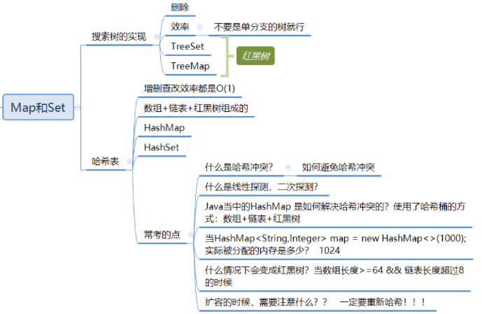
## 搜索树

**若它的左子树不为空，则左子树上所有节点的值都小于根节点的值**
**若它的右子树不为空，则右子树上所有节点的值都大于根节点的值**
**它的左右子树也分别为二叉搜索树**
![[img-20251216-1.png]]
中序遍历是有序的

### 操作

**查找**：拿目标值key与root进行比较，比root大的往右边搜索，比root小的往左边搜索；接着继续与左/右子树根结点比较，重复上面步骤

**插入**：我们可以定义一个cur，负责遍历二叉树；定义一个parent记录子树的根结点位置
如果当前cur结点的值比目标插入的值小，就把parent定位到当前结点，把cur往右子树移动
如果cur值较大就向左子树移。cur负责帮助parent定位到目标值附近
定义一个node承载目标值，如果parent的值小于目标值就把node右插，反之则左插
#### 删除

设待删除的结点是cur，而待删除结点的双亲结点是parent

**第一种情况：cur.left = null**

1. cur是root时，让root = cur.right
![[img-20251216-2.png]]
2. cur不是root，cur是parent.left，则parent.left = cur.right
![[img-20251216-3.png]]
3. cur不是root，cur是parent.right，则parent.right = cur.right
![[img-20251216-4.png]]

**第二种情况：cur.right == null**

1. cur是root，则root = cur.left

2. cur不是root，cur是parent.left，则parent.left = cur.left
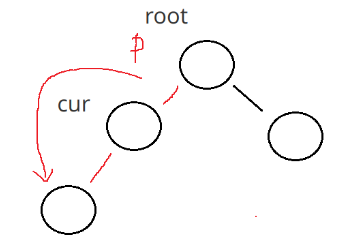
3. cur不是root，cur是parent.right，则parent.right = cur.left
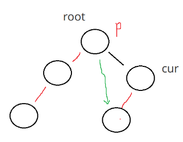

**第三种情况：cur.left != null && cur.right != null**
我们想要删除cur位置这个40元素
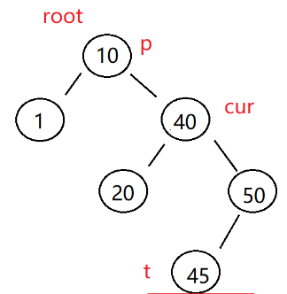


首先确定的一点是，40的左子树比40都小，右子树比40都大

替换法：找一个数据来替换cur

1.确定cur这里将来要放的数据一定比左边都大，比右边都小
2.在右树里面找到最小的数值来替换（右树最左边的数据）
3.找到合适的数据之后，直接替换cur的值，然后删除那个合适的数据结点

# 反射枚举lambda
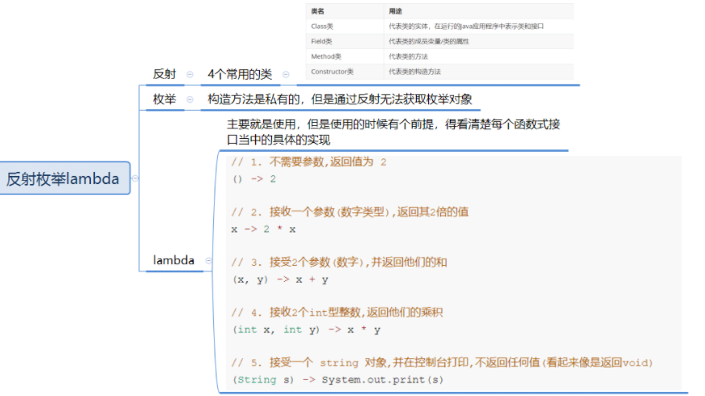
