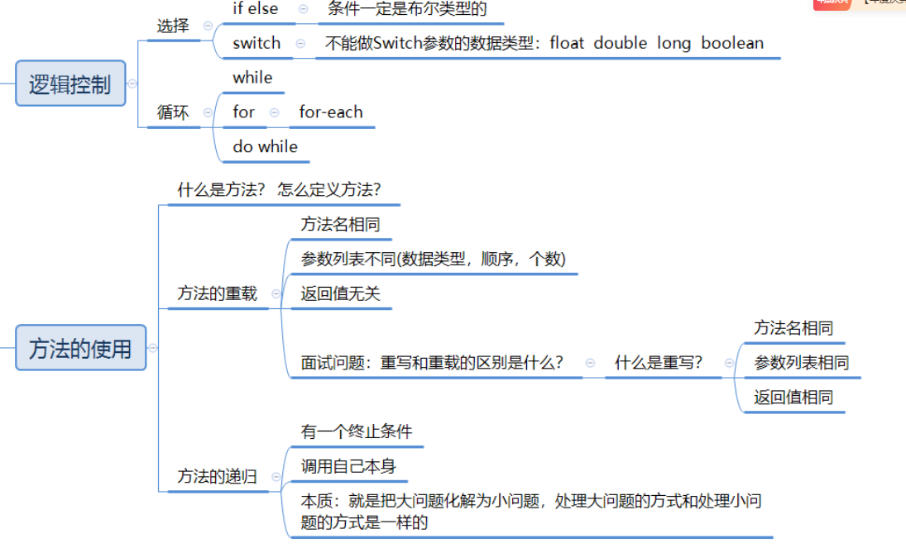
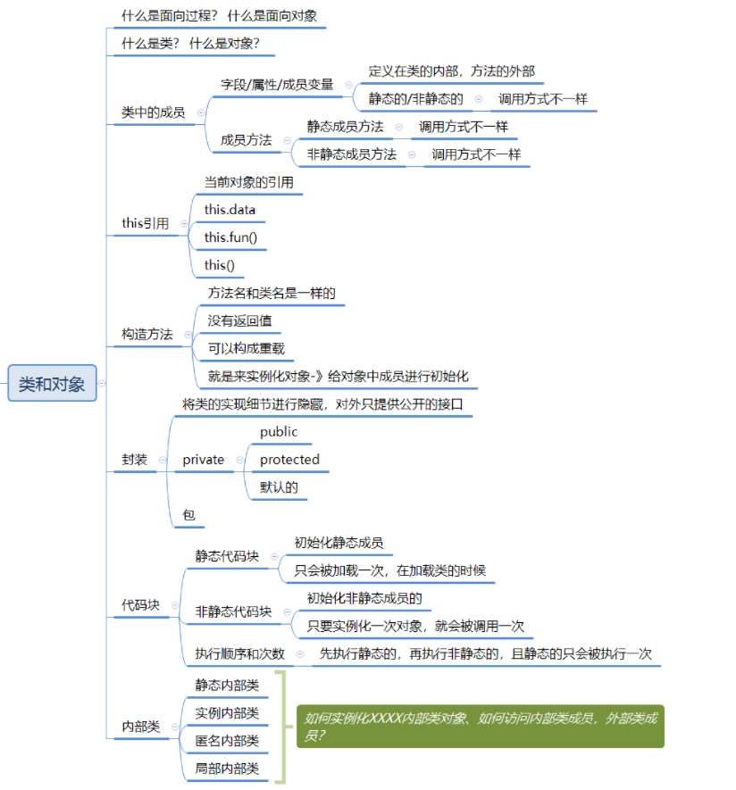
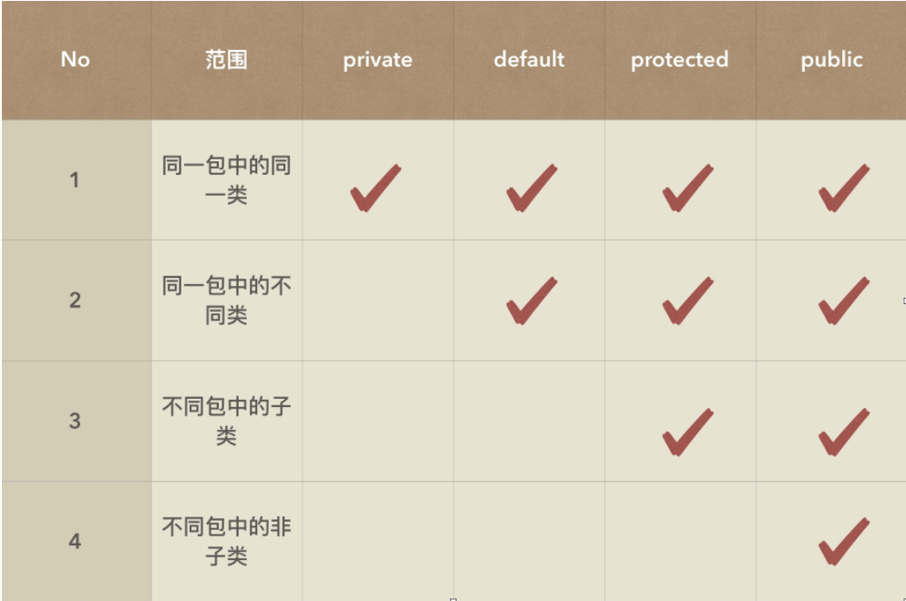
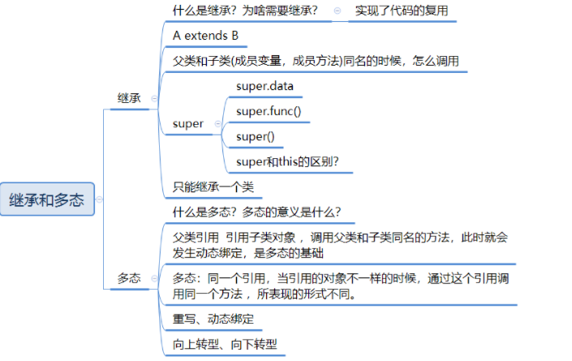

## 编译细节和基础知识


### javac, java, javap

**javac**：将 `.java` 源代码文件编译成 `.class` 字节码文件
Hello.java  --(javac编译)-->  Hello.class
命令：javac Hello.java

**Java**：启动 **JVM（Java 虚拟机）** 并运行已编译好的 `.class` 字节码。
Hello.class --(java运行)--> JVM执行
命令：java Hello

**javap**：反编译 `.class` 文件，用来查看 JVM 指令、类的结构、方法签名等。


### **8 种基本类型**

byte / short / int / long / float / double / char / boolean

### **包装类**

**作用**：
- 让基本类型拥有对象特性（用于集合、泛型等）
- 提供大量实用方法（解析字符串、类型转换）
- 支持自动装箱和自动拆箱
- 可以表示 null 值（基本类型做不到）
- 与泛型搭配必须使用包装类
- 内部有缓存机制，提高性能（如 IntegerCache）

最特殊：
- Integer
- Character
### 字节大小

- 整数：1/2/4/8
- 小数：4/8
- char：2
- boolean：不固定

### 类型转换规则

- 小 → 大（自动提升）
- 大 → 小（强制转换，可能溢出）
- 所有 byte/short/char 运算先变成 int

**强制类型转换（大 → 小）**
可能损失精度或溢出：
`double d = 3.14; int x = (int)d; // 结果为 3（小数部分丢失）`

## 方法



方法就是一段可以被重复调用的代码块，用来完成某个特定功能

### 重载和重写

|特性|**重载 Overload**|**重写 Override**|
|---|---|---|
|发生位置|同一个类中|父类与子类之间|
|方法名|**必须相同**|**必须相同**|
|参数列表|**必须不同**（数量 / 类型 / 顺序）|**必须相同**|
|返回类型|**可以不同**|**必须相同或是可以协变返回类型**|
|访问修饰符|无要求|子类权限必须 ≥ 父类（不能更严格）|
|异常|无要求|子类抛出的异常必须 ≤ 父类|
|绑定类型|编译时多态（静态绑定）|运行时多态（动态绑定）|
|目的|提高方法的灵活性|实现子类个性化行为|
什么是重载（Overload）？**在同一个类中，方法名相同，但参数列表不同，就是重载**
什么是重写（Override）？**子类对父类的方法进行重新实现，方法签名必须完全相同。**

### 什么是递归？

递归就是方法自己调用自己，通过不断把大问题拆成小问题来解决问题
#### StackOverflowError 发生机制（面试常问）

每次递归调用时 JVM 会：

1. 创建一个栈帧（stack frame）
2. 将局部变量、操作数栈、返回地址压入栈
3. 执行完毕后弹出（pop）

但是如果递归太深：

- 栈帧不断压入
- 没有及时弹出
- 栈空间不足
- JVM 抛出 StackOverflowError

这属于 **JVM Error（不可恢复）**，而不是 Exception。

如何避免？必须保证递归有明确的终止条件

## 数组


## 面向对象

**OOP有几个重要特征：封装，继承，多态**



### 定义

**面向过程**：就是以“步骤”为中心，通过一条一条指令处理事情的编程思想：面向过程就是以“**步骤**”为中心，通过一条一条指令处理事情的编程思想（就是先做啥，再做啥，最后做啥的思想）
**面向对象**：是以“对象”为中心，通过对象之间的协作完成任务的编程思想。**找对象、用对象**（关注对象、行为、属性）
**类**：类是**对象的模板**，是对一类事物的**抽象描述**。
**对象**：是根据**类创建出来的实例**，是真实存在的个体。**用类类型创建对象的过程，称为类的实例化**
### this

#### ① 代表当前对象（当前实例）的==引用==

这是 this 最基础、最核心的作用。

在对象方法中，`this` 就代表当前调用该方法的对象本身。

举例：

```java
public class Person {     
	public void show() {         
		System.out.println(this);  // 输出当前对象     
	} 
}
```

```java
Person p1 = new Person(); 
Person p2 = new Person();  
p1.show();  // this 指向 p1 
p2.show();  // this 指向 p2`
```

**谁调用方法，this 就指向谁。**

#### ② 访问当前对象的成员变量（this.data）

如果局部变量与成员变量**重名**，必须用 `this` 来区分。

场景：构造方法参数与成员变量重名

```java
public class Person {
    private String name;

    public Person(String name) {
        this.name = name;   // 左边是成员变量，右边是参数
    }
}

```

如果不写 this：

```name = name; // 两个 name 都是局部变量，成员变量永远不会赋值！```

#### ③ 调用当前对象的方法（this.fun()）

在类内部调用本类方法时，可以省略 this，也可以显式写出 this。


```java
public class Person {
    public void eat() {
        System.out.println("eat");
    }

    public void doSomething() {
        this.eat();   // 明确调用本对象的方法
        eat();        // 省略 this 也可以
    }
}
```

什么时候一定要写 this？  
👉 当方法名被局部变量遮挡、或代码可读性需要强调“当前对象”时。

#### ④ 调用当前类的构造方法（this()）

这是 many 学生 **最容易忽略** 的 this 用法。

在构造方法中，可以使用 `this()` 调用另一个构造方法，常用于 **构造方法之间的复用**。

示例：

```java
public class Person {
    private String name;
    private int age;

    public Person() {
        this("Unknown", 0);  // 调用另一个构造方法
    }

    public Person(String name, int age) {
        this.name = name;
        this.age = age;
    }
}
```

#### ⚠ 注意两条规则：

1. **this() 必须写在构造方法的第一行** ⇒ 因为构造方法执行前必须完成对象初始化流程
2. **this() 只能用于构造方法中，不能用于普通方法中**

### 构造方法

**特征**
1. 没有返回值
2. 方法名与类名相同
3. 构造方法可以有很多个，相同名字的构造方法之间构成**重载关系**

在生成对象，也就是**对象实例化**的时候，有两个**关键步骤**：
1. 为对象**分配内存**
2. 调用**合适的构造方法**（一个对象在它的生命周期中，只会调用**一次**构造方法，因为构造方法只负责“对象初始化”。对象创建完成后，它就不会再初始化第二次）

### 封装




封装：语法上说，就是用private修饰成员变量和变量方法，表示只能在当前类中应用。将类的实现细节进行隐藏，对外只提供公开的接口




| 对比点                  | **this**                                 | **super**                   |
| -------------------- | ---------------------------------------- | --------------------------- |
| **含义**               | 代表 **当前对象本身**                            | 代表 **当前对象的父类对象**            |
| **访问成员变量**           | `this.data` 访问自己的成员变量                    | `super.data` 访问父类的成员变量      |
| **访问成员方法**           | `this.fun()` 调用当前类的方法                    | `super.fun()` 调用父类被覆盖的方法    |
| **访问构造方法**           | `this()` 调用本类其他构造方法                      | `super()` 调用父类构造方法          |
| **构造方法中的要求**         | `this()` 必须是构造方法的第一句                     | `super()` 必须是构造方法的第一句       |
| **是否能同时出现**          | `this()` 和 `super()` **不能同时出现在同一个构造方法中** | 同左                          |
| **使用场景**             | 成员变量隐藏；方法明确指本类；构造方法复用                    | 子类重写父类方法时需要调用父类版本；初始化父类部分   |
| **默认行为**             | 若不写 this，系统自动使用                          | 若不写 super，构造方法默认加：`super()` |
| **是否能出现在 static 中？** | ❌ 静态方法不能使用 this                          | ❌ 静态方法不能使用 super            |
| **是否能用于调用本类静态成员？**   | 不推荐，但可以（this.name → 编译期解析）               | super 不能调用静态成员，因为静态与类本身相关   |
| **本质**               | 当前对象的引用                                  | 当前对象内部“父类那部分”的引用            |