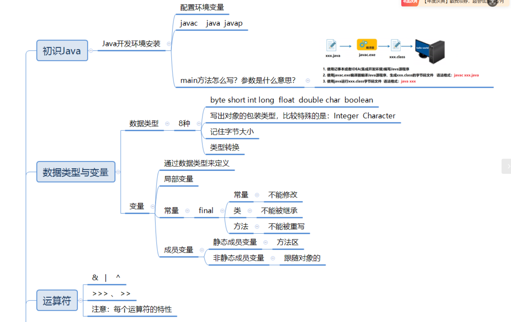
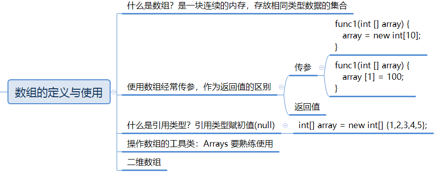
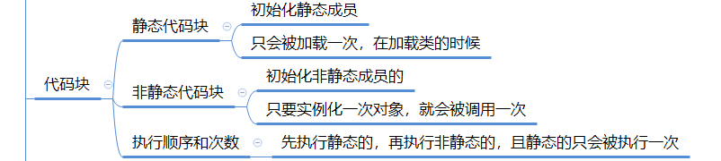
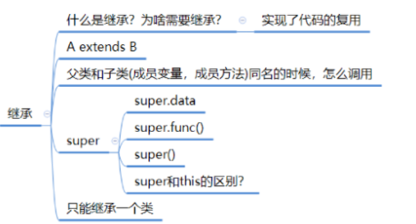
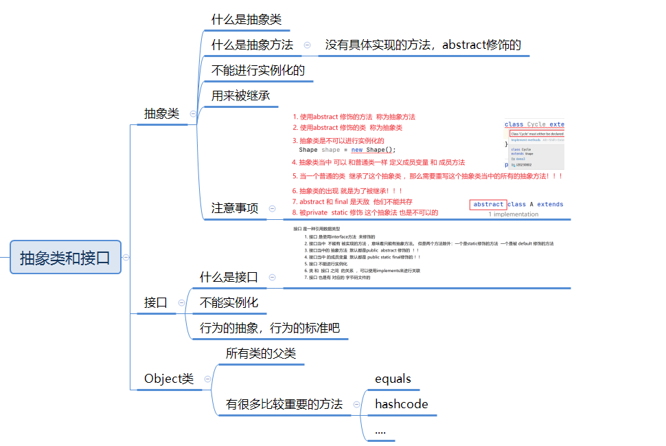
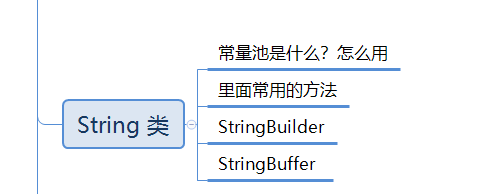
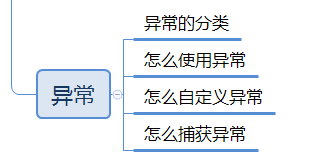

# 编译细节和基础知识



### javac, java, javap

**javac**：将 `.java` 源代码文件编译成 `.class` 字节码文件
Hello.java  --(javac编译)-->  Hello.class
命令：javac Hello.java

**Java**：启动 **JVM（Java 虚拟机）** 并运行已编译好的 `.class` 字节码。
Hello.class --(java运行)--> JVM执行
命令：java Hello

**javap**：反编译 `.class` 文件，用来查看 JVM 指令、类的结构、方法签名等。

### **8 种基本类型**

byte / short / int / long / float / double / char / boolean

### **包装类**

**作用**：
- 让基本类型拥有对象特性（用于集合、泛型等）
- 提供大量实用方法（解析字符串、类型转换）
- 支持自动装箱和自动拆箱
- 可以表示 null 值（基本类型做不到）
- 与泛型搭配必须使用包装类
- 内部有缓存机制，提高性能（如 IntegerCache）

最特殊：
- Integer
- Character
### 字节大小

- 整数：1/2/4/8
- 小数：4/8
- char：2
- boolean：不固定

### 类型转换规则

- 小 → 大（自动提升）
- 大 → 小（强制转换，可能溢出）
- 所有 byte/short/char 运算先变成 int

**强制类型转换（大 → 小）**
可能损失精度或溢出：
`double d = 3.14; int x = (int)d; // 结果为 3（小数部分丢失）`

### 静态变量和非静态遍历

**静态变量**属于**类**，所有对象**共享**；
**非静态变量（实例变量）** 属于**对象**，每个对象**独立**

# 方法


方法就是一段可以被重复调用的代码块，用来完成某个特定功能

### 重载和重写

|特性|**重载 Overload**|**重写 Override**|
|---|---|---|
|发生位置|同一个类中|父类与子类之间|
|方法名|**必须相同**|**必须相同**|
|参数列表|**必须不同**（数量 / 类型 / 顺序）|**必须相同**|
|返回类型|**可以不同**|**必须相同或是可以协变返回类型**|
|访问修饰符|无要求|子类权限必须 ≥ 父类（不能更严格）|
|异常|无要求|子类抛出的异常必须 ≤ 父类|
|绑定类型|编译时多态（静态绑定）|运行时多态（动态绑定）|
|目的|提高方法的灵活性|实现子类个性化行为|
什么是重载（Overload）？**在同一个类中，方法名相同，但参数列表不同，就是重载**
什么是重写（Override）？**子类对父类的方法进行重新实现，方法签名必须完全相同。**

### 什么是递归？

递归就是方法自己调用自己，通过不断把大问题拆成小问题来解决问题
#### StackOverflowError 发生机制（面试常问）

每次递归调用时 JVM 会：

1. 创建一个栈帧（stack frame）
2. 将局部变量、操作数栈、返回地址压入栈
3. 执行完毕后弹出（pop）

但是如果递归太深：

- 栈帧不断压入
- 没有及时弹出
- 栈空间不足
- JVM 抛出 StackOverflowError

这属于 **JVM Error（不可恢复）**，而不是 Exception。

如何避免？必须保证递归有明确的终止条件


# 数组




# 面向对象

**OOP有几个重要特征：封装，继承，多态**


### 定义

**面向过程**：就是以“步骤”为中心，通过一条一条指令处理事情的编程思想：面向过程就是以“**步骤**”为中心，通过一条一条指令处理事情的编程思想（就是先做啥，再做啥，最后做啥的思想）
**面向对象**：是以“对象”为中心，通过对象之间的协作完成任务的编程思想。**找对象、用对象**（关注对象、行为、属性）
**类**：类是**对象的模板**，是对一类事物的**抽象描述**。
**对象**：是根据**类创建出来的实例**，是真实存在的个体。**用类类型创建对象的过程，称为类的实例化**

### 静态VS非静态

| 类型               | 存在位置        | 归属      | 是否需要对象      | 生命周期           |
| ---------------- | ----------- | ------- | ----------- | -------------- |
| **静态成员（static）** | 方法区（元空间）    | 属于“类本身” | ❌ 不需要对象即可访问 | 类加载开始 → 程序结束   |
| **非静态成员（实例成员）**  | 堆内存（每个对象独立） | 属于“对象”  | ✔ 必须通过对象访问  | 对象创建开始 → 对象被回收 |

| 类型       | 属于谁 | 调用方式  | 能否访问实例成员   | 何时存在  |
| -------- | --- | ----- | ---------- | ----- |
| **静态变量** | 类   | 类名.变量 | ❌ 不需要      | 类加载时  |
| **实例变量** | 对象  | 对象.变量 | ✔          | 对象创建时 |
| **静态方法** | 类   | 类名.方法 | ❌ 不能访问实例成员 | 类加载时  |
| **实例方法** | 对象  | 对象.方法 | ✔ 可以访问全部成员 | 对象创建时 |
### this

#### ① 代表当前对象（当前实例）的==引用==

这是 this 最基础、最核心的作用。

在对象方法中，`this` 就代表当前调用该方法的对象本身。

举例：

```java
public class Person {     
	public void show() {         
		System.out.println(this);  // 输出当前对象     
	} 
}
```

```java

Person p1 = new Person(); 
Person p2 = new Person();  
p1.show();  // this 指向 p1 
p2.show();  // this 指向 p2`
```

**谁调用方法，this 就指向谁。**

#### ② 访问当前对象的成员变量（this.data）

如果局部变量与成员变量**重名**，必须用 `this` 来区分。

场景：构造方法参数与成员变量重名

```java
public class Person {
    private String name;

    public Person(String name) {
        this.name = name;   // 左边是成员变量，右边是参数
    }
}

```

如果不写 this：

```name = name; // 两个 name 都是局部变量，成员变量永远不会赋值！```

#### ③ 调用当前对象的方法（this.fun()）

在类内部调用本类方法时，可以省略 this，也可以显式写出 this。


```java
public class Person {
    public void eat() {
        System.out.println("eat");
    }

    public void doSomething() {
        this.eat();   // 明确调用本对象的方法
        eat();        // 省略 this 也可以
    }
}
```

什么时候一定要写 this？  
👉 当方法名被局部变量遮挡、或代码可读性需要强调“当前对象”时。

#### ④ 调用当前类的构造方法（this()）

这是 many 学生 **最容易忽略** 的 this 用法。

在构造方法中，可以使用 `this()` 调用另一个构造方法，常用于 **构造方法之间的复用**。

示例：

```java
public class Person {
    private String name;
    private int age;

    public Person() {
        this("Unknown", 0);  // 调用另一个构造方法
    }

    public Person(String name, int age) {
        this.name = name;
        this.age = age;
    }
}
```

#### ⚠ 注意两条规则：

1. **this() 必须写在构造方法的第一行** ⇒ 因为构造方法执行前必须完成对象初始化流程
2. **this() 只能用于构造方法中，不能用于普通方法中**

### 构造方法

**特征**
1. 没有返回值
2. 方法名与类名相同
3. 构造方法可以有很多个，相同名字的构造方法之间构成**重载关系**

在生成对象，也就是**对象实例化**的时候，有两个**关键步骤**：
1. 为对象**分配内存**
2. 调用**合适的构造方法**（一个对象在它的生命周期中，只会调用**一次**构造方法，因为构造方法只负责“对象初始化”。对象创建完成后，它就不会再初始化第二次）

## OOP第一大特性：封装


封装：语法上说，就是用private修饰成员变量和变量方法，表示只能在当前类中应用。**将类的实现细节进行隐藏，对外只提供公开的接口**

**包**：在面向对象体系中，**为了更好的管理类，把多个类收集在一起成为一组，称为软件包**。有点类似于目录。

### 代码块



#### 静态代码块
```java
class Person {
    static {
        System.out.println("静态代码块执行！");
    }
}

```
#### 构造代码块
```java
class Person {
    {
        System.out.println("构造代码块执行！");
    }
}

```
### 四种内部类
#### 静态内部类

- 不依赖外部类对象而存在
- 可以访问外部类的静态成员，不能直接访问实例成员
#### 实例内部类（成员内部类 / Member Inner Class）

- 必须依赖外部类对象
- 能访问外部类 **所有成员（包括 private）**

## OOP第二大特性：继承



**继承**是面向对象三大特性之一，指子类可以继承父类的属性和方法，从而拥有父类的能力。
为啥要继承？可以实现代码**复用**。父类写一套通用代码，子类无需重复写。

⚠ 当父类和子类的成员变量同名时，在子类当中使用时，优先打印子类的成员变量。成员变量访问遵循**就近原则**，自己优先自己的，没有的话向父类找

访问修斯限定符**只能决定访问权限**，**不能决定能不能被继承**。类的成员（变量/方法）是否会被子类继承，与访问修饰符无关。决定继承关系的是 `extends`，不是权限。
访问修饰符只决定：
- 子类能不能 **访问** 父类成员
- 外部类能不能访问
所以子类该继承继承，只是不能调用而已。
### super

| 对比点                  | **this**                                 | **super**                              |
| -------------------- | ---------------------------------------- | -------------------------------------- |
| **含义**               | 代表 **当前对象本身**                            | 代表 **当前对象的父类对象**                       |
| **访问成员变量**           | `this.data` 访问自己的成员变量                    | `super.data` 访问父类的成员变量                 |
| **访问成员方法**           | `this.fun()` 调用当前类的方法                    | `super.fun()` 调用父类被覆盖的方法               |
| **访问构造方法**           | `this()` 调用本类其他构造方法                      | `super()` 调用父类构造方法                     |
| **构造方法中的要求**         | `this()` 必须是构造方法的第一句                     | `super()` 必须是构造方法的第一句                  |
| **是否能同时出现**          | `this()` 和 `super()` **不能同时出现在同一个构造方法中** | 同左                                     |
| **使用场景**             | 成员变量隐藏；方法明确指本类；构造方法复用                    | 子类重写父类方法时需要调用父类版本；初始化父类部分（**在不同包的子类**） |
| **默认行为**             | 若不写 this，系统自动使用                          | 若不写 super，构造方法默认加：`super()`            |
| **是否能出现在 static 中？** | ❌ 静态方法不能使用 this                          | ❌ 静态方法不能使用 super                       |
| **是否能用于调用本类静态成员？**   | 不推荐，但可以（this.name → 编译期解析）               | super 不能调用静态成员，因为静态与类本身相关              |
| **本质**               | 当前对象的引用                                  | 当前对象内部“父类那部分”的引用                       |

类加载：父类静态 → 子类静态（先执行且只执行一次）
对象创建：父类实例 → 父类构造 → 子类实例 → 子类构造（每 new 一次都执行）

⚠子类的构造方法要放在第一行。当子类继承了父类之后，再构造子类对象的时候一定要先帮助父类进行构造。

## OOP第三大特性：多态


**多态**：去完成某个行为，当不同的对象去完成时会产生出不同的状态
**好处**：降低代码复杂度，拓展性强

**条件:**
1. 继承关系上-->**向上转型**
2. 子类和父类有同名的**覆盖/重写**方法
3. 通过父类对象的引用去调用这个**重写**的方法

### 向上转型

父类引用指向子类对象（自动进行，不用强制转换）。

1. 直接赋值时（最常见）
   `Animal a = new Dog();`
2. 方法参数传递时
```java
   func(Animal a);
   func(new Dog());
```
3. 方法返回值时
```java
   Animal func() {
       return new Dog();
   }
```

**编译**只能用**父类**的成员；**运行**的时候执行**子类重写**的方法

**好处**
✔ 统一数据结构（父类引用接收子类对象）  
✔ 提升代码扩展性（新增子类无需改方法）  
✔ 是多态的前提（运行时绑定实现动态分派）
### 动态绑定

完成上面三个条件可以触发动态绑定

动态绑定：**运行时才决定调用哪个方法，而不是编译时决定。**
这是 Java 实现 **运行时多态** 的根本原因。

### 重写

**子类对父类中已经存在的方法进行重新实现。**

满足三个条件：

1. 方法名相同
2. 参数列表相同
3. 返回值相同

并且：

- 访问权限不能比父类更严格
- 父类方法不能是 `private`，`final`，`static`来修饰
- 构造方法不能重写


# 抽象类和接口

### 抽象类


1. 使用abstract修饰的方法称为抽象方法
2. 使用abstract修饰的类称为抽象类
3. 抽象类不可以被实例化 e.g.Shape shape = new Shape()//err
4. 抽象类当中可以和普通类一样定义成员变量和方法
5. 继承抽象类？当一个普通的类继承了抽象类，需要重写这个抽象类中所有的抽象方法！所以抽象类不能和`final`共存，因为final这个关键字就是不让类重写的
6. 不能被`private`和`static`修饰
7. **抽象类的出现为了被继承**：如果有些工作应由子类完成而非父类，那么父类是抽象类的话可以在实例化的时候报错，因为抽象类本身不能被实例化，要想使用，只能创建该抽象类的子类，然后重写抽象方法，这样可以让我们更容易发现问题。（作用）

### 接口

**接口：公共的行为规范标准**

1. 接口是使用**interface**修饰的
2. 接口当中不能有被实现的方法，只能有抽象方法，但是被static和default方法修饰的方法除外
3. 接口当中的抽象方法默认都是public abstract修饰的
4. 接口当中的成员变量默认都是public static final修饰的
5. 接口不能进行实例化
6. 类和接口之间的关系，可以使用implements来进行关联
7. 系统给出两种选择，要么抽象要么重写。重写接口方法的时候不能使用默认的访问权限
8. 接口虽然不是类，但也是有对应的字节码文件.class的
9. 接口中不能有代码块和构造方法 

类和类：extends
接口和接口：extends
接口和类：implements

| 项目        | 抽象类       | 接口               |
| --------- | --------- | ---------------- |
| 核心意义      | 提取共性 + 模板 | 强制实现一组能力         |
| 是否用于 is-a | ✔ 是       | ❌ 不是             |
| 是否能写普通方法  | ✔ 能       | ✔（default），但目的不同 |
| 是否能写成员变量  | ✔ 能       | 只能常量             |
| 多继承       | ❌ 不支持     | ✔ 支持             |

## 克隆和拷贝

Java 中**克隆**一般指：通过 clone() 方法复制一个对象，使新对象与原对象拥有相同的数据，却是两个独立的对象。

**浅拷贝**：只复制对象本身（成员变量的值），但不会复制对象内部的引用对象。**内部对象仍指向同一块内存**。
浅拷贝默认是 clone() 的实现方式。

**深拷贝**：不仅复制对象本身，还复制对象内部的所有引用对象，形成完全独立的一份副本
外层对象不同  
内部对象也不同  
引用链上的所有对象都各自独立

# String 

String 是不可变对象（immutable）
`String s = "abc"; s = "def"; // 实际上创建了新的对象`
修改 String 并不是改变原对象，而是创建了新的 String。




### 常量池

Java 为了**节省内存**，把所有字面量字符串放入一个全局共享区域字符串常量池（String Pool）
### 方法

**（1）字符串比较相关**

- `==`：比较引用是否相同
- `equals()`：比较内容
- `compareTo()`：按字典序比较
- `compareToIgnoreCase()`：忽略大小写比较

**（2）查找**

- `indexOf()`：从前往后查找
- `lastIndexOf()`：从后往前查找

**（3）截取**

- `substring(begin)`
- `substring(begin, end)`（前闭后开）

**（4）转换相关**

- `toUpperCase()` / `toLowerCase()`：大小写转换
- `toCharArray()`：String → char[]
- `String.valueOf()`：任意类型 → String
- `trim()`：去除首尾空白字符

**（5）替换**

- `replaceAll()`：全部替换
- `replaceFirst()`：替换第一个

**（6）拆分**
- `split(regex)`：按正则拆分字符串

| 特性   | String        | StringBuilder         | StringBuffer |
| ---- | ------------- | --------------------- | ------------ |
| 可变性  | ❌ 不可变         | ✔ 可变                  | ✔ 可变         |
| 线程安全 | ✔ 安全（不可变自身安全） | ❌ 不安全（没有synchronized） | ✔ 安全（同步）     |
| 性能   | 最慢            | 最快                    | 中等           |
| 适用场景 | 字面量、少量操作      | 单线程大量拼接/修改            | 多线程环境        |
# 异常



### 大类


1. **Throwable**：是异常体系的顶层类，其派生出两个重要的子类, Error 和 Exception
2. **Error**：指的是**Java虚拟机无法解决的严重问题**，比如：JVM的内部错误、资源耗尽等，典型代表：StackOverflowError和OutOfMemoryError，一旦发生回力乏术。
3. **Exception**：异常产生后**程序员可以通过代码进行处理**，使程序继续执行。比如：感冒、发烧。我们平时所说的异常就是Exception。
	**① 继承 Exception → 受查异常** 编译器异常
	- 必须处理（try-catch 或 throws）
	**② 继承 RuntimeException → 非受查异常** 运行时异常
	- 不强制处理，更常用于业务逻辑错误

### throw VS throws

throw —— **方法内部使用**

- 手动抛出异常对象
- 语法：`throw new XXXException(...)`
- 抛出后方法立即结束
- 用于业务校验（如参数非法）

throws —— **方法声明使用**

- 表示“本方法可能抛出异常，由调用者处理”
- 语法：`方法名(...) throws A, B`
- 可声明多个异常
- Checked Exception 必须声明或捕获

### 捕获异常

```
try 中抛异常 → catch 匹配？
    ↓
若无匹配 → 向调用者抛出（继续传播）
    ↓
直至 main 仍未捕获 → 程序终止 + 打印异常堆栈
```


